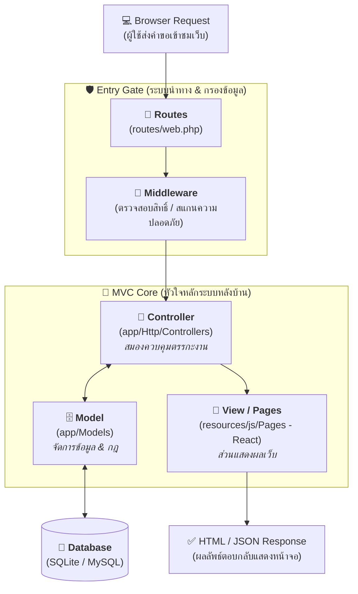
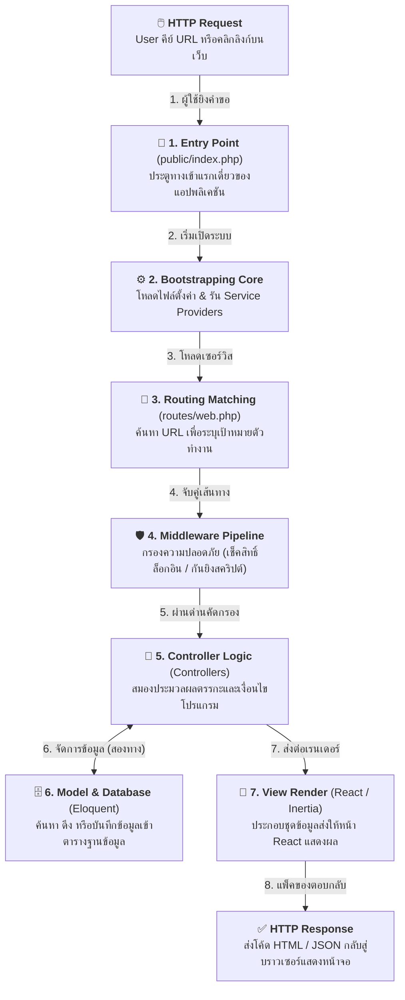
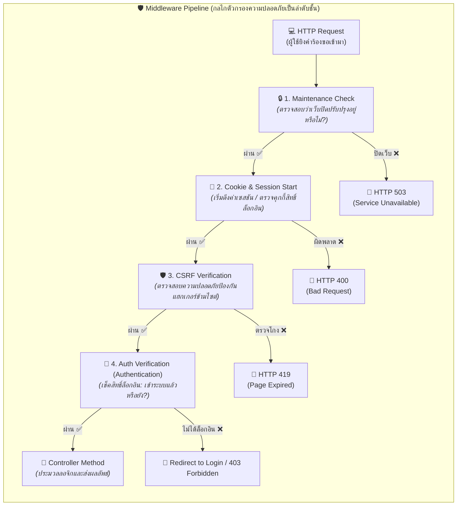
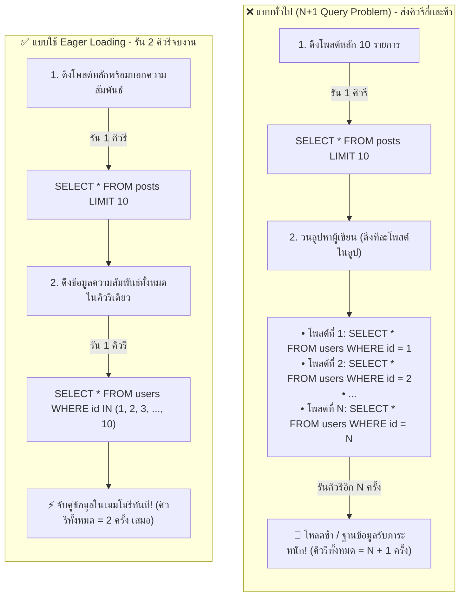
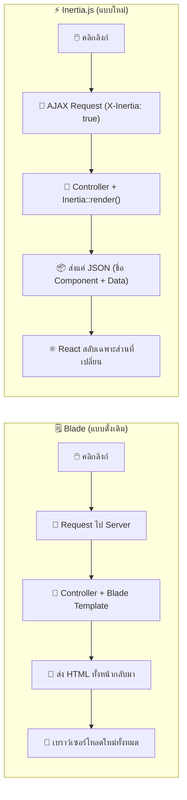
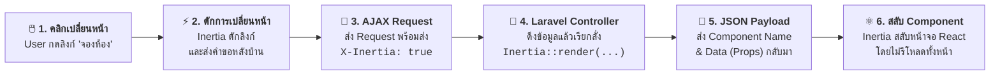
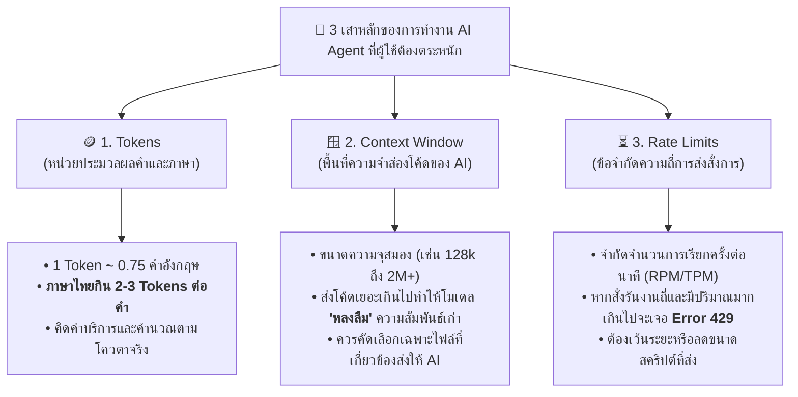
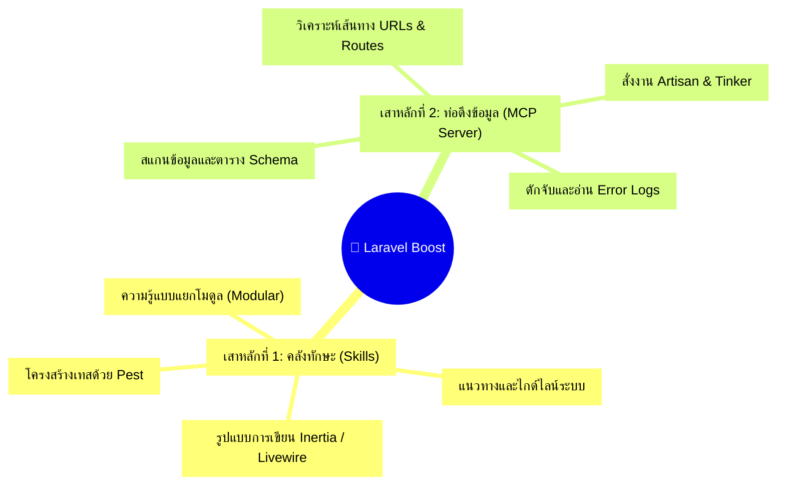
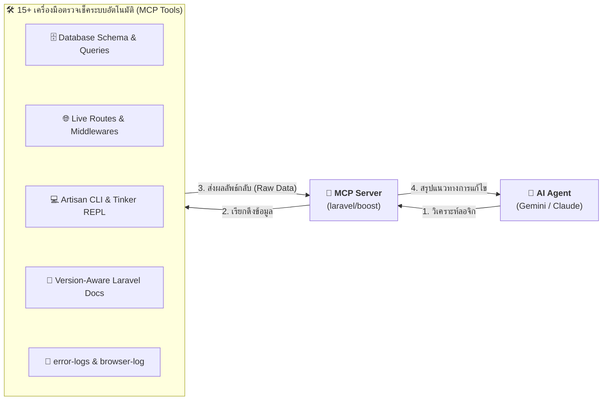

#  Laravel + AI Agent — Bootcamp

> **โครงการอบรมเชิงปฏิบัติการ**  
> การประยุกต์ใช้ปัญญาประดิษฐ์ (AI) เพื่อการพัฒนาระบบสารสนเทศสำหรับองค์กร  
> วิทยากร: นายชัยมงคล แก้วสี

---

## Agenda

| Part | หัวข้อ | เนื้อหา |
|------|--------|---------|
| **Part 1** | บทนำ | AI-Assisted Development, ทำไมต้องใช้ Laravel + AI |
| | ติดตั้งเครื่องมือ | WSL บน Windows, PHP Stack |
| | เริ่มโปรเจกต์ | Laravel 13, Git Version Control |
| | โครงสร้าง | MVC, Routing, Controller, Middleware |
| | ฐานข้อมูล | Eloquent ORM & Relationships, N+1 Query Problem |
| | หน้าตาเว็บ | React Components & Inertia.js (View) |
| | ตรวจสอบข้อมูล | Validation & Error Handling |
| | ระบบ Auth | ส่องไฟล์ระบบยืนยันตัวตนจาก Starter Kit |
| **Part 2** | AI Agent CLI | Claude Code, Antigravity CLI, OpenCode |
| | AI Fundamentals | Token, Context Window, Rate Limit |
| | Laravel + AI | Boost AI, Skills & MCP |
| | Prompt Patterns | Generate CRUD, Debug, Test, Review |

---

## บทนำ: AI สองแบบ ต่างกันอย่างไร

> [!NOTE]
> เลือกใช้ให้ถูกงาน — ใน **Part 1** ใช้ Chat UI ช่วยเรียนรู้ทฤษฎี ใน **Part 2** ใช้ Agent CLI ทำ Workshop จริงใน Terminal

| คุณสมบัติ | AI Chat UI | AI Agent CLI |
|---|---|---|
| **ตัวอย่าง** | Claude.ai, ChatGPT, Gemini | Claude Code, Antigravity CLI, OpenCode |
| **สภาพแวดล้อม** | Browser / Desktop App | Terminal |
| **ขอบเขตข้อมูล** | เฉพาะโค้ดที่คัดลอกไปวาง | เข้าถึงและมองเห็นทั้ง Project |
| **ความสามารถ** | - ถาม-ตอบ, อธิบาย Concept<br>- ช่วย Debug จาก Error message ที่ส่งให้<br>- แนะนำ Best Practices ทั่วไป | - อ่านโค้ด, สร้าง/แก้ไขไฟล์จริงในระบบ<br>- รันคำสั่ง Terminal และรัน Test แทนเรา<br>- ทำ Workflow ซับซ้อนแบบอัตโนมัติ |
| **เหมาะสำหรับ** | เรียนรู้เชิงทฤษฎีและเขียนโค้ดเบื้องต้น | ทำ Workshop จริง, สร้าง Feature ครบวงจร |

---

## บทนำ: ทำไมต้องใช้ Laravel + AI

| แบบเดิม (Manual Development) | ใช้ AI ช่วย (AI-Assisted) |
|---------|-----------|
| เขียนเองทุกบรรทัด ใช้เวลานาน | AI ช่วย Generate โครงสร้างโค้ดและส่วนซ้ำซ้อนทันที |
| ค้นหาและแก้ไข Error ด้วยตัวเองซึ่งทำได้ยาก | AI วิเคราะห์และช่วย Debug พร้อมระบุจุดผิดพลาดตรงจุด |
| ใช้เวลาอ่าน Documentation นานเพราะเนื้อหาเยอะ | AI สรุปและอธิบาย Concept สำคัญให้เข้าใจได้ทันที |
| ลองผิดลองถูกแบบไม่มีทิศทาง | AI แนะนำ Best Practices และ Security Standards ให้ตั้งแต่แรก |

> [!IMPORTANT]
> **AI ไม่ใช่ตัวแทนที่จะมาทำงานแทนเราทั้งหมด แต่เป็นผู้ช่วย (Co-pilot) ที่ทำให้เราเรียนรู้และพัฒนาได้เร็วขึ้น 3–5 เท่า**

---

## 1.  ติดตั้ง WSL 2 (Windows Subsystem for Linux 2)

### WSL 2 คืออะไร ทำไมต้องใช้?

**Windows Subsystem for Linux 2 (WSL 2)** คือฟีเจอร์ของ Windows ที่ช่วยให้เราสามารถรันสภาพแวดล้อม Linux (เช่น Ubuntu) ได้โดยตรงแบบ Native โดยไม่ต้องติดตั้ง Virtual Machine ที่กินทรัพยากรสูง หรือทำ Dual Boot ให้ยุ่งยาก

| คุณสมบัติ | VM / Dual Boot | WSL 2 |
|---|---|---|
| **ทรัพยากร** | รัน OS เต็มรูปแบบ กิน RAM และ Disk สูง | น้ำหนักเบา ใช้ทรัพยากรน้อยและยืดหยุ่น |
| **ความสะดวก** | ต้องแยก Disk หรือต้อง Restart เครื่องเพื่อสลับ OS | รันควบคู่กับ Windows ได้ทันที ไม่ต้อง Restart |
| **ประสิทธิภาพ** | ค่อนข้างช้า มี overhead สูง | เร็วเทียบเท่า Native Linux, Composer และ Node.js ทำงานลื่นไหล |
| **การเชื่อมต่อไฟล์** | แชร์ไฟล์ข้ามระบบได้ยากและช้า | เข้าถึงไฟล์ข้ามกันระหว่าง Windows และ Linux ได้โดยตรงและรวดเร็ว |

### ขั้นตอนการติดตั้ง WSL 2

```powershell
# 1. เปิด PowerShell ด้วยสิทธิ์ Administrator
# Start → ค้นหา "PowerShell" → คลิกขวา → เลือก "Run as Administrator"

# 2. ติดตั้ง WSL และ Ubuntu (Default Distribution)
wsl --install
# คำสั่งนี้จะทำการเปิดใช้งาน Virtual Machine Platform และดาวน์โหลด Ubuntu ให้โดยอัตโนมัติ

# 3. Restart เครื่องคอมพิวเตอร์ของคุณเพื่อใช้การตั้งค่า
shutdown /r /t 0
```

```bash
# 4. หลัง Restart — ระบบจะเปิดหน้าต่าง Ubuntu ให้ตั้ง Unix Username และ Password ของคุณ

# อัปเดตรายการและแพ็กเกจระบบให้เป็นเวอร์ชันล่าสุด
sudo apt update && sudo apt upgrade -y

# 5. ตรวจสอบเวอร์ชันของ WSL (ต้องมั่นใจว่าเป็น Version 2)
wsl -l -v
```

> [!TIP]
> **AI Prompt Tip** — สามารถถาม AI เพิ่มเติมเมื่อเจอปัญหา: *"แนะนำขั้นตอนการแก้ไขหากติดตั้ง WSL 2 บน Windows 11 แล้วพบ Error [ระบุ Error]"*

---

## 2.  ติดตั้ง Stack: PHP 8.4 ·  Composer · Node.js

```bash
# 1. ติดตั้ง PHP 8.4 และสภาพแวดล้อมการพัฒนาทั้งหมดด้วยคำสั่งเดียวจาก php.new
/bin/bash -c "$(curl -fsSL https://php.new/install/linux/8.4)"

# ตรวจสอบความถูกต้องของการติดตั้ง
php -v
composer --version

# 2. ติดตั้ง Node.js 20 LTS + npm (สำคัญมากสำหรับรัน Vite, Tailwind และ React)
curl -fsSL https://deb.nodesource.com/setup_20.x | sudo -E bash -
sudo apt install nodejs -y

# ตรวจสอบการติดตั้ง Node.js และ npm
node -v
npm -v
```

> [!NOTE]
> - **PHP** เปรียบเสมือน "เครื่องยนต์หลัก" ที่ทำให้แอปพลิเคชันของคุณทำงานได้
> - **Composer** เปรียบเสมือน "ผู้จัดการพัสดุ/ไลบรารี" ที่คอยหาโค้ดเสริมภายนอกมาช่วยทำงาน
> - **Node.js** เปรียบเสมือน "ทีมช่างตกแต่งหน้าบ้าน" ที่คอยคอมไพล์ CSS/JS และควบคุม UI ให้สวยงามทันสมัย

---

## 3.  การสร้างโปรเจกต์ Laravel 13

### แนะนำ: สร้างด้วย `laravel new` (Interactive Wizard)

```bash
laravel new myApp
```

ตัวช่วยติดตั้งจะเปิดหน้าต่าง Interactive Wizard เพื่อถามความต้องการของเราทีละขั้นตอน:


#### ขั้นตอนที่ 1 — เลือก Starter Kit → เลือก **React**
*การเลือก **React** จะทำการติดตั้ง **React 19** + **Inertia.js** ให้โดยอัตโนมัติ ซึ่งดีที่สุดสำหรับการทำ Single Page Application (SPA)*

#### ขั้นตอนที่ 2 — Authentication Provider → เลือก **Laravel's built-in authentication**
*เลือก **Laravel's built-in** เพื่อใช้ระบบ Login/Register ภายในที่ปลอดภัยและไม่ต้องพึ่งพาคลาวด์ภายนอก*

#### ขั้นตอนที่ 3 — Database → เลือก **SQLite**
*SQLite ดีมากสำหรับการพัฒนาทั่วไปเพราะจัดเก็บในไฟล์เดียว ไม่ต้องรัน Database Server แยก*

#### ขั้นตอนที่ 4 — Teams Support → เลือก **No**

#### ขั้นตอนที่ 5 — Testing Framework → เลือก **Pest**
*Pest มีไวยากรณ์ที่สะอาดตา อ่านง่าย และเหมาะกับโปรเจกต์สมัยใหม่มากกว่า PHPUnit*

#### ขั้นตอนที่ 6 — Laravel Boost → เลือก **Yes**
***Laravel Boost** เป็นตัวสร้าง Context ของโปรเจกต์สำหรับส่งต่อให้ AI Agents (เช่น Claude Code หรือ Antigravity) ช่วยให้ AI เข้าใจโครงสร้าง Codebase ได้อย่างแม่นยำ*

#### ขั้นตอนที่ 7 — Authentication Features → เลือก **ทั้งหมด**
*(Email verification, Registration, Password confirmation, Two-factor authentication, Passkeys)*
*กด Spacebar เพื่อเลือก/ยกเลิก และกด Enter เพื่อตกลง*

#### ขั้นตอนที่ 8 — npm Dependencies → เลือก **Yes**

---

### โครงสร้างเทคโนโลยีที่ได้ (Tech Stack Summary)

| เทคโนโลยี | เวอร์ชัน | บทบาทหน้าที่ |
|---|---|---|
|  **Laravel** | 13 | Backend Framework (ขับเคลื่อนด้วย PHP 8.2+) |
|  **React** | 19 | Frontend UI Library สำหรับสร้างหน้าตาเว็บที่ยืดหยุ่น |
|  **Inertia.js** | 1.x | ตัวเชื่อมประสาน (Bridge) ระหว่าง Backend กับ React SPA โดยไม่ต้องเขียน API แยก |
|  **Vite** | ล่าสุด | Frontend Build Tool ที่ช่วยคอมไพล์โค้ดด้วยความเร็วสูง |
|  **SQLite** | 3.x | ระบบฐานข้อมูลแบบไฟล์เดียวน้ำหนักเบาสำหรับขั้นตอนพัฒนา |

```bash
# การเริ่มต้นรันเซิร์ฟเวอร์
cd myApp
composer run dev   # คำสั่งลัดในการเปิดใช้งาน Laravel และ Vite พร้อมกัน
```

> [!IMPORTANT]
> **💡 เคล็ดลับการรัน Dev Servers คู่ขนาน (Backend & Frontend)**
> ในขั้นตอนการพัฒนาระบบร่วมกับ React/Inertia คุณจะต้องรันเซิร์ฟเวอร์ทั้ง 2 ส่วนควบคู่กันเสมอ:
> 1. **รันฝั่ง Backend:** เปิด Terminal หน้าต่างแรก พิมพ์ `php artisan serve` เพื่อให้บริการรันโค้ด PHP
> 2. **รันฝั่ง Frontend:** เปิด Terminal หน้าต่างที่สอง พิมพ์ `npm run dev` เพื่อให้ Vite คอยคอมไพล์และฮอตโหลดหน้าจอ React
> *(หากผู้เรียนพิมพ์แต่ `php artisan serve` อย่างเดียว หน้าจอจะไม่แสดงผลและพบหน้าต่างข้อความเตือนสีแดง Vite manifest not found)*


---

## 4.  Git — การควบคุมเวอร์ชันและประวัติโค้ด

**Git** คือระบบควบคุมเวอร์ชัน (Version Control) ที่ช่วยบันทึกการเปลี่ยนแปลงของโค้ดในแต่ละจุด ทำให้สามารถย้อนประวัติ หรือทำงานร่วมกับผู้อื่นได้โดยที่โค้ดไม่ทับกัน

```bash
# 1. แอดไฟล์เข้าสู่ระบบเตรียมการบันทึก
git add .

# 2. บันทึกประวัติพร้อมระบุข้อความอธิบายการเปลี่ยนแปลง (Commit Message)
git commit -m "feat: install Laravel with React and SQLite"

# 3. ตรวจสอบประวัติย้อนหลัง
git log --oneline -n 5
```

> [!TIP]
> **Best Commit Practices:**
> - มุ่งเน้นการ commit เป็นชิ้นงานเล็กๆ ที่ทำงานได้จริง (Atomic Commits)
> - ใช้รูปแบบ Conventional Commits เช่น:
>   - `feat: ...` (เพิ่มฟีเจอร์ใหม่)
>   - `fix: ...` (แก้ไขบัก)
>   - `docs: ...` (ปรับปรุงเอกสาร)
>   - `refactor: ...` (ปรับปรุงโครงสร้างโค้ดโดยไม่มีฟีเจอร์ใหม่)

---

## 5. โครงสร้างโฟลเดอร์ของ Laravel

ในการพัฒนาโปรเจกต์ เราจะใช้เวลาอยู่กับโฟลเดอร์เหล่านี้มากกว่า 90% ของเวลาทั้งหมด:

```
myApp/
├── app/                    # สมองและส่วนลอจิกหลักของโปรแกรม
│   ├── Http/Controllers/   # Controller — รับ Request, ดำเนินงาน, ส่งข้อมูลกลับ
│   ├── Http/Middleware/    # Middleware — ประตูคัดกรองความปลอดภัยก่อนถึง Controller
│   └── Models/             # Model — ตัวแทนตารางฐานข้อมูลและการจัดการข้อมูลด้วย Eloquent
├── config/                 # โฟลเดอร์เก็บไฟล์ตั้งค่าต่างๆ ของระบบ
├── database/
│   ├── migrations/         # ไฟล์ประวัติโครงสร้างตารางฐานข้อมูล
│   └── seeders/            # ไฟล์สำหรับสร้างข้อมูลตัวอย่างในฐานข้อมูล
├── public/                 # โฟลเดอร์หน้าบ้านสำหรับเซิร์ฟเวอร์รัน (index.php, static assets)
├── resources/
│   ├── js/                 # ส่วนหน้าบ้าน React Components (Pages/Components)
│   └── views/              # ไฟล์ app.blade.php (หน้ากาก HTML Shell หลักสำหรับ Inertia)
├── routes/
│   └── web.php             # ไฟล์กำหนดทิศทาง URL ของหน้าเว็บ
├── .env                    # ไฟล์สำหรับเก็บค่า Configuration ที่มีความลับและแตกต่างกันในแต่ละเครื่อง
└── composer.json           # ไฟล์เก็บรายการและเวอร์ชันของ Composer Packages
```

---

## 6. การจัดการค่าคอนฟิกูเรชันผ่าน `.env`

ไฟล์ `.env` เป็นที่สำหรับเก็บค่าตัวแปรสภาพแวดล้อม (Environment Variables) เช่น การเชื่อมต่อฐานข้อมูล หรือ API Keys

```bash
APP_NAME=Laravel
APP_ENV=local
APP_DEBUG=true            # ต้องตั้งเป็น false เสมอเมื่อรันบนเซิร์ฟเวอร์จริง (Production)!
APP_KEY=base64:xxxx...    # คีย์สำหรับเข้ารหัสข้อมูลสำคัญ หากว่างให้รัน: php artisan key:generate
APP_URL=http://localhost

# SQLite configuration (ตั้งค่าเริ่มต้นของ Laravel 13)
DB_CONNECTION=sqlite

# การเปลี่ยนไปใช้ MySQL (ใช้ใน Production)
# DB_CONNECTION=mysql
# DB_HOST=127.0.0.1
# DB_PORT=3306
# DB_DATABASE=myapp_db
# DB_USERNAME=root
# DB_PASSWORD=secret_password
```

> [!TIP]
> **⚙️ การเตรียมฐานข้อมูล SQLite ก่อนรันคำสั่ง Migrate:**
> 1. คัดลอกและสร้างไฟล์ `.env` เสมอหากเริ่มโปรเจกต์ใหม่: `cp .env.example .env`
> 2. ตรวจสอบให้มั่นใจว่าไฟล์ `.env` มีการตั้งค่า `DB_CONNECTION=sqlite` เรียบร้อย
> 3. ใน Laravel 13 หากไม่มีไฟล์ `database/database.sqlite` ระบบจะทำการสร้างขึ้นมาให้คุณโดยอัตโนมัติเมื่อสั่งรัน `php artisan migrate`

> [!WARNING]
> **กฎเหล็กเพื่อความปลอดภัย:**
> - ห้ามเอาไฟล์ `.env` ขึ้น Git Repository เป็นอันขาดเพราะมีรหัสผ่านและความลับของระบบ
> - ใช้ไฟล์ `.env.example` เป็นแม่แบบให้ทีมงานคัดลอกไปสร้าง `.env` ของตนเองแทน

---

## 7. โครงสร้างสถาปัตยกรรมแบบ MVC (Model-View-Controller)



---

## 8. Routes — การกำหนดเส้นทาง URL

เส้นทางทราฟฟิกเว็บทั้งหมดจะถูกกำหนดในไฟล์ `routes/web.php`

```php
use App\Http\Controllers\PostController;

// การกำหนด Route แบบเดี่ยว — ชี้ไปยัง Controller
Route::get('/', [PostController::class, 'index']);

// การกำหนด Resource Route บรรทัดเดียว ได้ถึง 7 หน้าการทำงานหลัก
Route::resource('posts', PostController::class);
```

> [!NOTE]
> **Inertia.js Project ไม่ใช้ `return view()` ใน Route Closure**  
> ในโปรเจกต์ที่ใช้ React Starter Kit การ Render หน้าจอทำผ่าน `Inertia::render()` ใน Controller เสมอ — ดูรายละเอียดใน [Section 15](#_15-react-pages-inertiajs-ระบบ-render-หน้ากากเว็บฝั่งหน้าบ้าน)

การทำงานของ `Route::resource` จะจับคู่กับ Controller อัตโนมัติ ดังนี้:

| HTTP Method | URL Pattern | Controller Method | Route Name | อธิบายหน้าที่ |
|---|---|---|---|---|
| **GET** | `/posts` | `index` | `posts.index` | แสดงรายการทั้งหมด |
| **GET** | `/posts/create` | `create` | `posts.create` | แสดงแบบฟอร์มสร้างข้อมูลใหม่ |
| **POST** | `/posts` | `store` | `posts.store` | บันทึกข้อมูลใหม่ลงฐานข้อมูล |
| **GET** | `/posts/{post}` | `show` | `posts.show` | แสดงข้อมูลรายละเอียดเฉพาะตัว |
| **GET** | `/posts/{post}/edit` | `edit` | `posts.edit` | แสดงแบบฟอร์มสำหรับแก้ไขข้อมูล |
| **PUT/PATCH** | `/posts/{post}` | `update` | `posts.update` | บันทึกการแก้ไขข้อมูลลงฐานข้อมูล |
| **DELETE** | `/posts/{post}` | `destroy` | `posts.destroy` | ลบข้อมูลออกจากฐานข้อมูล |

```bash
# คำสั่งสำหรับดูลิสต์เส้นทางทั้งหมดในระบบ
php artisan route:list
```

---

## 9. วงจรการทำงานของ Request (Request Lifecycle)



---

## 10. Controller — ผู้ควบคุมลอจิกและประสานงาน

```bash
# คำสั่งสร้าง Resource Controller พร้อมเมธอดมาตรฐาน 7 ตัวแบบอัตโนมัติ
php artisan make:controller PostController --resource
```

```php
namespace App\Http\Controllers;

use App\Models\Post;
use Illuminate\Http\Request;
use Inertia\Inertia;

class PostController extends Controller
{
    // 1. แสดงรายการทั้งหมด
    public function index()
    {
        $posts = Post::latest()->paginate(10);
        return Inertia::render('Posts/Index', [
            'posts' => $posts,
        ]);
    }

    // 2. บันทึกข้อมูลใหม่
    public function store(Request $request)
    {
        $validated = $request->validate([
            'title' => 'required|min:3|max:255',
            'body' => 'required',
        ]);

        Post::create($validated);

        return redirect()->route('posts.index')->with('success', 'สร้างบทความสำเร็จแล้ว');
    }

    // 3. ปรับปรุงข้อมูลที่แก้ไข
    public function update(Request $request, Post $post)
    {
        $validated = $request->validate([
            'title' => 'required|min:3|max:255',
            'body' => 'required',
        ]);

        $post->update($validated);

        return redirect()->route('posts.index')->with('success', 'แก้ไขข้อมูลสำเร็จแล้ว');
    }

    // 4. ลบข้อมูล
    public function destroy(Post $post)
    {
        $post->delete();
        return redirect()->route('posts.index')->with('success', 'ลบข้อมูลสำเร็จแล้ว');
    }
}
```

---

## 11. Middleware — ด่านตรวจกรอง Request

**Middleware** คือชั้นกรอง HTTP Request ก่อนที่จะเข้าถึงเมธอดลอจิกใน Controller



```php
// การตั้งค่าความปลอดภัยให้ครอบคลุมทั้งกลุ่ม Resource Routes (ต้อง Login ก่อนเท่านั้น)
Route::middleware(['auth'])->group(function () {
    Route::resource('posts', PostController::class);
});
```

---

## 12. HTTP Methods เปรียบเทียบกับโลกแห่งความเป็นจริง

| Method | หน้าที่เป้าหมาย | ตัวอย่างงาน | เปรียบเสมือน |
|---|---|---|---|
| **GET** | เรียกอ่านข้อมูล | ดึงรายการข้อมูลห้องประชุม | 📖 เปิดอ่านหน้าหนังสือ |
| **POST** | ส่งข้อมูลใหม่เพื่อบันทึก | ลงทะเบียนจองห้องประชุม | 📝 กรอกข้อมูลลงใบสมัครใหม่ |
| **PUT/PATCH** | แก้ไขข้อมูลที่มีอยู่แล้ว | อัปเดตเวลาจองห้อง | ✏️ ลบและแก้ไขข้อมูลในใบสมัครเดิม |
| **DELETE** | ลบข้อมูลที่เลือกออก | ยกเลิกรายการจองห้องประชุม | 🗑 โยนเอกสารสมัครใบเดิมทิ้งถังขยะ |

---

## 13. Eloquent ORM: การเชื่อมต่อและการจัดการข้อมูลในฐานข้อมูล

**Eloquent ORM** คือระบบ Object-Relational Mapping ของ Laravel ที่ช่วยให้เราติดต่อและสั่งการ Database ได้โดยเขียนเป็นคลาส PHP สั้นๆ แทนการพิมพ์โค้ด SQL ที่มีความยาวและยากแก่การบำรุงรักษา

```php
// ❌ รูปแบบเดิม (เขียน SQL Raw)
$users = DB::select('SELECT * FROM users WHERE status = "active" ORDER BY created_at DESC');

// ✅ รูปแบบ Eloquent ORM (สั้น กระชับ ปลอดภัยจาก SQL Injection โดยปริยาย)
$users = User::where('status', 'active')->latest()->get();
```

### การทำ CRUD พื้นฐานด้วย Eloquent
```php
// C - Create: บันทึกข้อมูลแถวใหม่
$post = Post::create([
    'title' => 'แนะนำ Laravel 13',
    'body'  => 'เนื้อหาที่เป็นประโยชน์ในการเริ่มต้นเขียนโค้ด...'
]);

// R - Read: ดึงข้อมูลขึ้นมาอ่าน
$allPosts  = Post::all();                     // ดึงข้อมูลทั้งหมดในตาราง
$singlePost = Post::findOrFail(1);            // ค้นหา ID: 1 หากไม่พบจะแสดง Error 404 อัตโนมัติ

// U - Update: บันทึกข้อมูลที่แก้ไข
$singlePost->update([
    'title' => 'การติดตั้ง Laravel 13 บน WSL 2'
]);

// D - Delete: ลบข้อมูลที่ต้องการ
$singlePost->delete();
```

---

## 14. ทำความเข้าใจและการแก้ไขปัญหา N+1 Query ด้วย Eager Loading

ปัญหา **N+1 Query** เป็นหนึ่งในปัญหาคลาสสิกที่เกิดขึ้นบ่อยที่สุดในระบบ ORM ซึ่งส่งผลเสียอย่างรุนแรงต่อความเร็วของระบบเนื่องจากมีการรันคิวรีในลูปเป็นร้อยๆ ครั้งโดยไม่จำเป็น



### โค้ดที่ก่อให้เกิดปัญหา (N+1 Query)
```php
// ดึงข้อมูลบทความ 10 บทความ (รันคิวรี 1 ครั้งเพื่อดึง Posts)
$posts = Post::limit(10)->get();

foreach ($posts as $post) {
    // ในทุกๆ บทความ จะมีการส่งคำสั่ง SQL ไปดึง User ที่เป็นผู้เขียนอีก 1 ครั้ง (รันคิวรีอีก N ครั้ง!)
    // รวมทำงานคิวรีทั้งหมดเป็น 1 + 10 = 11 ครั้ง
    echo $post->user->name;
}
```

### แนวทางแก้ไขด้วย Eager Loading (`with`)
การใช้ Eager Loading จะดึงข้อมูลความสัมพันธ์ทั้งหมดขึ้นมารอไว้ตั้งแต่แรก ทำให้ประหยัดการรันคิวรีเหลือเพียง 2 ครั้งเท่านั้นไม่ว่าจะมีจำนวนข้อมูลในตารางกี่ล้านแถวก็ตาม

```php
// ดึงข้อมูลบทความทั้งหมดพร้อมกับโหลดข้อมูลผู้เขียนขึ้นมารอไว้ทันทีด้วยเมธอด with()
$posts = Post::with('user')->limit(10)->get();

foreach ($posts as $post) {
    // ดึงค่าผู้เขียนจากเมมโมรีได้ทันทีโดยไม่มีการติดต่อฐานข้อมูลเพิ่มอีก
    echo $post->user->name;
}
```

### สรุปรูปแบบความสัมพันธ์ (Eloquent Relationships)

| ชื่อความสัมพันธ์ | เมธอดในความสัมพันธ์ | ตัวอย่างการประยุกต์ใช้งาน |
|---|---|---|
| **One-to-One (1:1)** | `hasOne()` / `belongsTo()` | ผู้ใช้งาน 1 คน (`User`) มีรูปภาพโปรไฟล์ได้ 1 รูป (`Avatar`) |
| **One-to-Many (1:N)** | `hasMany()` / `belongsTo()` | ลูกค้า 1 คน (`User`) สามารถกดสั่งซื้อสินค้าได้หลายรายการ (`Order`) |
| **Many-to-Many (N:M)** | `belongsToMany()` | บทความ 1 เรื่อง (`Post`) สามารถมีได้หลายป้ายกำกับ (`Tag`) และป้ายกำกับ 1 อันก็อยู่ในหลายบทความได้ |

---

## 15. React Pages & Inertia.js — ระบบ Render หน้ากากเว็บฝั่งหน้าบ้าน

ในโปรเจกต์ที่ใช้ **React Starter Kits** (เช่น Laravel Breeze React) เราจะไม่ต้องใช้ระบบ Template ของ Blade ในการจัดโครงสร้างหน้าเว็บหลักอีกต่อไป แต่จะหันมาพัฒนาส่วนติดต่อผู้ใช้งานด้วย **React (Frontend)** โดยมี **Inertia.js** ทำหน้าที่เป็นตัวเชื่อมประสานระบบหลังบ้านและหน้าบ้านเข้าด้วยกัน

---

### ⚖️ ทำไมต้องใช้ Inertia.js แทน Blade?

ก่อนที่จะเรียนรู้วิธีการทำงานของ Inertia.js ควรทำความเข้าใจก่อนว่า **Blade** และ **Inertia.js** แตกต่างกันอย่างไร และทำไมในยุค AI-Assisted Development เราจึงเลือก Inertia.js



#### เปรียบเทียบโดยตรง

| หัวข้อ | 🗒️ Blade | ⚡ Inertia.js + React |
|:---|:---|:---|
| **การโหลดหน้า** | โหลดใหม่ทั้งหมดทุกครั้ง (Full Reload) | สลับเฉพาะส่วนที่เปลี่ยน (No Reload) |
| **ประสบการณ์ผู้ใช้** | หน้าจอกระพริบ มีรอยสะดุด | ลื่นไหลเหมือนแอปมือถือ |
| **ภาษาที่ใช้ใน View** | PHP + HTML ปนกัน (`.blade.php`) | React JSX ล้วน (`.jsx`) |
| **การส่งข้อมูล** | `compact()` → Blade Variables | `Inertia::render()` → React Props |
| **ระบบ Auth** | Session Cookie (Laravel จัดการ) | Session Cookie เหมือนเดิม — ไม่ต้องเขียน JWT |
| **Routing** | กำหนดใน `web.php` เหมือนเดิม | กำหนดใน `web.php` เหมือนเดิม — ไม่ต้อง React Router |
| **API แยก** | ไม่ต้องการ | **ไม่ต้องการเช่นกัน** — Inertia เชื่อมให้เอง |
| **ความเหมาะสมกับ AI** | AI ต้องเขียนทั้ง PHP และ Blade syntax | AI โฟกัสได้ที่ React Component เดียว |

> [!NOTE]
> **จุดแข็งที่สุดของ Inertia.js** คือการได้ประสบการณ์ผู้ใช้แบบ SPA (เร็ว ลื่น ไม่กระพริบ) โดยไม่ต้องแยกโปรเจกต์หน้าบ้าน-หลังบ้าน ไม่ต้องเขียน REST API และไม่ต้องจัดการ JWT Token — ระบบ Auth, Routing และ Validation ของ Laravel ยังคงทำงานเหมือนเดิมทุกอย่าง

---

### 💡 Inertia.js คืออะไร?

**Inertia.js** ไม่ใช่ภาษาหรือเฟรมเวิร์กใหม่ แต่เป็น **"สะพานเชื่อมโยง (Glue)"** ที่ทำหน้าที่เชื่อมต่อหน้าบ้านที่เป็น Single Page Application (SPA) เช่น React หรือ Vue เข้ากับระบบควบคุมหลังบ้าน (Routing & Controller) ของ Laravel 

โดยปกติหากเขียนแอปพลิเคชันแบบ SPA ด้วย React เรามักจะต้องแยกโปรเจกต์หน้าบ้าน-หลังบ้านออกจากกัน เขียนระบบ API (เช่น REST API หรือ GraphQL) คอยคุยแลกเปลี่ยนข้อมูล จัดระบบ Authentication ด้วย Tokens (JWT) และเขียนตัวจัดการเส้นทาง (React Router) เพิ่มเติมด้านหน้า ซึ่งมีความซับซ้อนสูงมาก

**Inertia.js ช่วยแก้ปัญหานี้โดยการอนุญาตให้คุณสร้างแอป React ได้โดยไม่ต้องเขียน API แยก** คุณยังคงใช้เส้นทางเว็บ (web.php) และส่งค่าผ่าน Controller ของ Laravel เหมือนการพัฒนาเว็บทั่วไป แต่ผลลัพธ์หน้าจอที่ผู้ใช้งานเห็นจะลื่นไหลรวดเร็วเทียบเท่า SPA จริงๆ!

---

### 🔄 หลักการทำงานแบบไม่รีโหลดหน้าจอ (Single-Page Application Lifecycle)

เมื่อเกิดกิจกรรมเปลี่ยนหน้าต่างบนบราวเซอร์ การแลกเปลี่ยนข้อมูลจะทำงานดังนี้:

1. **ดักจับคำขอ (Link Interception):** ตัวไลบรารีของ Inertia บนเบราว์เซอร์จะดักจับเหตุการณ์การคลิกลิงก์บนเว็บ ป้องกันไม่ให้เบราว์เซอร์รีโหลดหน้าจอใหม่ทั้งหมดแบบดั้งเดิม (Prevent Page Reload)
2. **ยิงคำขอเบื้องหลัง (AJAX Request):** ยิงคำขอไปหา Laravel Controller แบบเบื้องหลังพร้อมแนบ Header พิเศษ `X-Inertia: true`
3. **การตอบกลับแบบ JSON (Inertia Response):** ฝั่ง Laravel Controller จะตรวจจับ Header นั้น และแทนที่จะส่งโค้ดโครงสร้าง HTML ทั้งหน้ากลับไป มันจะเลือกแพ็กเฉพาะ **ชื่อเพจ React** พร้อมส่งข้อมูล **Data (Props)** ส่งกลับไปในรูปแบบ JSON แทน
4. **การอัปเดตหน้าจอ (DOM Swapping):** ฝั่ง Inertia หน้าร้านจะรับข้อมูล JSON ไปโหลดไฟล์ Page Component ของ React แล้วเปลี่ยนสับเปลี่ยนองค์ประกอบของเว็บตรงจุดที่ต้องการโดยอัตโนมัติ ทำให้เว็บทำงานทันใจ ไม่เกิดรอยสะดุดจอดำหรือหน้าต่างกระพริบ



---

### 💻 ตัวอย่างโค้ดเปรียบเทียบการทำงาน

#### 1. ฝั่งหลังบ้าน (Controller) — ส่งข้อมูลผ่าน Inertia
เราจะเรียกใช้คลาส `Inertia` แทนตัวควบคุมหน้ากาก View เดิม เพื่อระบุตำแหน่ง Component ของ React และแนบข้อมูลเพื่อส่งผ่านเป็น Props ไปยังหน้าบ้าน

```php
// app/Http/Controllers/PostController.php
namespace App\Http\Controllers;

use App\Models\Post;
use Inertia\Inertia;

class PostController extends Controller
{
    public function index()
    {
        // ดึงข้อมูลทั้งหมดจากตารางบทความ
        $posts = Post::all();

        // เรนเดอร์หน้า React ที่อยู่ใน resources/js/Pages/Posts/Index.jsx
        // พร้อมแนบส่งตัวแปร $posts ไปใช้เป็นตัวแปรหน้าบ้าน
        return Inertia::render('Posts/Index', [
            'posts' => $posts
        ]);
    }
}
```

#### 2. ฝั่งหน้าบ้าน (React Page) — รับข้อมูลมาแสดงผล
ที่โฟลเดอร์ `resources/js/Pages/` เราจะสร้างหน้าจอเขียนด้วย React (JSX) และดึงข้อมูลที่ Controller ส่งมาให้ผ่านพารามิเตอร์ `Props` มาใช้แสดงผลได้ทันที

```jsx
// resources/js/Pages/Posts/Index.jsx
import React from 'react';
import Layout from '@/Layouts/AppLayout';

// รับตัวแปร posts จาก Laravel Controller เข้ามาเป็น Props ทันที
export default function Index({ posts }) {
    return (
        <Layout>
            <h1 className="text-2xl font-bold mb-4">รายการบทความ</h1>
            
            <div className="space-y-4">
                {posts.map((post) => (
                    <article key={post.id} className="bg-white p-4 shadow rounded border">
                        <h2 className="text-xl font-semibold text-blue-900">{post.title}</h2>
                        <p className="text-gray-600 mt-2">{post.body}</p>
                    </article>
                ))}
            </div>
        </Layout>
    );
}
```

---

## 16. การตรวจสอบข้อมูลด้วย Form Request Validation

เพื่อป้องกันและรับประกันความปลอดภัยของข้อมูลในระบบ เราควรย้ายลอจิกการตรวจรูปแบบข้อมูลไปไว้ในไฟล์ **Form Request** เสมอ

```bash
# สั่งสร้างไฟล์ตรวจสอบความถูกต้องของข้อมูล (Form Request)
php artisan make:request StorePostRequest
```

```php
// app/Http/Requests/StorePostRequest.php
namespace App\Http\Requests;

use Illuminate\Foundation\Http\FormRequest;

class StorePostRequest extends FormRequest
{
    // กำหนดสิทธิ์ในการทำรายการนี้ (True คืออนุญาตให้ทำได้ทุกคน)
    public function authorize(): bool
    {
        return true;
    }

    // กำหนดเงื่อนไขและกฎความถูกต้องของข้อมูล (Validation Rules)
    public function rules(): array
    {
        return [
            'title'    => ['required', 'min:3', 'max:255'],
            'email'    => ['required', 'email', 'unique:users,email'],
            'password' => ['required', 'min:8', 'confirmed'], // ตรวจสอบรหัสผ่านคู่กับ password_confirmation
            'age'      => ['required', 'integer', 'min:18'],
            'avatar'   => ['nullable', 'image', 'max:2048'],  // ตรวจไฟล์รูปภาพขนาดไม่เกิน 2MB
        ];
    }
}
```

> [!TIP]
> **Security Tip:** ใช้คำสั่ง `$request->validated()` แทน `$request->all()` เสมอใน Controller เพื่อนำไปบันทึกข้อมูล เพราะจะคืนค่าเฉพาะข้อมูลที่ผ่านการตรวจสอบในกฎแล้วเท่านั้น ป้องกันการทำ Mass Assignment Vulnerability

---

## 17.  ระบบยืนยันตัวตนจาก Starter Kit (Laravel Breeze)

เมื่อเราเลือกติดตั้งผ่าน **Starter Kit (React)** พร้อมกับ **Laravel's built-in authentication** ตั้งแต่ขั้นตอนสร้างโปรเจกต์ (`laravel new`) ระบบจะทำการติดตั้งและเตรียมโครงสร้างไฟล์ของ **Laravel Breeze** มาให้เราใช้งานทันทีโดยไม่ต้องลงแพ็กเกจซ้ำ!

### 📂 โครงสร้างระบบยืนยันตัวตนที่สำคัญ
เมื่อ Starter Kit ทำงานเสร็จสิ้น จะเกิดการเปลี่ยนแปลงโครงสร้างโฟลเดอร์ของโปรเจกต์ที่เราควรรู้จักดังนี้:

1. **Authentication Controllers (`app/Http/Controllers/Auth/`)**
   - รวบรวม Controller ที่ใช้จัดการ Flow ทั้งหมด เช่นการสมัครสมาชิก (`RegisteredUserController`), การเข้าสู่ระบบ (`AuthenticatedSessionController`), และการเปลี่ยนรหัสผ่าน (`PasswordController`)
2. **Authentication Routes (`routes/auth.php`)**
   - ไฟล์เก็บเส้นทาง URL (Routes) ทั้งหมดของระบบ Auth เช่น `/login`, `/register`, `/forgot-password` โดยถูกดึงไปโหลดรวมไว้ใน `routes/web.php` เรียบร้อยแล้ว
3. **Frontend Views & SPA Pages (`resources/js/Pages/Auth/`)**
   - ไฟล์หน้าจออินเตอร์เฟสสำหรับการทำ Single Page Application (เช่น `Login.jsx`, `Register.jsx`, `ForgotPassword.jsx`) ที่พร้อมใช้งานและออกแบบมาอย่างสวยงามด้วย Tailwind CSS

> [!NOTE]
> **ทำไมระบบพร้อมใช้เลย?** เนื่องจากในขั้นตอนการติดตั้ง `laravel new` ตัวช่วยติดตั้งจะสั่งรัน `php artisan breeze:install react` ให้อัตโนมัติทางเบื้องหลัง เราจึงข้ามขั้นตอนการติดตั้ง Manual และพร้อมรันฐานข้อมูลด้วย `php artisan migrate` เพื่อเริ่มเขียนระบบต่อได้ทันที!
>
> [!CAUTION]
> **⚠️ ข้อควรระวังขั้นสูง: ห้ามติดตั้งซ้ำ!**
> เนื่องจาก Starter Kit ถูกเซ็ตอัปเรียบร้อยพร้อมใช้งานอยู่แล้ว **ผู้เรียนห้ามรันคำสั่ง `php artisan breeze:install react` ซ้ำในระหว่างเรียนเด็ดขาด** เพราะคำสั่งนี้จะไปเขียนทับหน้าจออินเตอร์เฟสและลบโครงสร้างไฟล์เดิมที่คุณเขียนขึ้นมาทั้งหมดจนระบบพังได้! ให้เริ่มต้นใช้ระบบที่มีอยู่ได้ทันที
>
> ---
>
> ### 🔑 การเข้าสู่ระบบแบบไร้รหัสผ่านด้วย Passkeys (WebAuthn)
>
> ใน Laravel Breeze เวอร์ชันล่าสุด ได้เพิ่มฟีเจอร์การยืนยันตัวตนแบบไร้รหัสผ่านด้วย **Passkeys (มาตรฐาน WebAuthn)** เข้ามาเป็นทางเลือกพื้นฐาน ซึ่งช่วยยกระดับความปลอดภัยและความสะดวกในการใช้งานดังนี้ครับ:
>
> 1. **Passkeys คืออะไร:** เทคโนโลยีการล็อกอินที่ใช้ระบบความปลอดภัยของตัวเครื่องของผู้ใช้ (Biometrics) แทนการกรอกรหัสผ่าน เช่น การสแกนลายนิ้วมือ (Touch ID), การสแกนใบหน้า (Face ID / Windows Hello) หรือใช้กุญแจความปลอดภัยแบบเสียบ (YubiKey)
> 2. **การทำงานร่วมกับบราวเซอร์:** ระบบจะเรียกใช้งานฟังก์ชัน `navigator.credentials` ของบราวเซอร์ เพื่อสื่อสารกับชิปรักษาความปลอดภัยในอุปกรณ์เครื่องนั้นๆ ในการบันทึกกุญแจดิจิทัล (Cryptographic Key)
> 3. **การทำงานใน Laravel Breeze:**
>    - **หน้าเข้าสู่ระบบ (Login):** จะมีปุ่มล็อกอินด้วย Passkey เพิ่มขึ้นมาข้างช่องกรอกรหัสผ่าน ผู้ใช้สามารถสแกนนิ้วหรือหน้าเพื่อยืนยันตัวตนแล้วเข้าหน้าแดชบอร์ดได้ทันที
>    - **หน้าการตั้งค่าบัญชี (Profile Settings):** มีเมนูให้ผู้ใช้สามารถกดเพิ่มคีย์อุปกรณ์ (Register Passkey) หรือจัดการลบคีย์อุปกรณ์ที่ลงทะเบียนไว้ได้ด้วยตนเอง
> 4. **ข้อดีด้านความปลอดภัย:** ป้องกันการโจรกรรมประเภท Phishing ได้ 100% เพราะไม่มีการส่งรหัสผ่านใดๆ ผ่านอินเทอร์เน็ต และกุญแจความลับ (Private Key) จะเก็บอยู่เฉพาะในเครื่องชิปนิรภัยบนเครื่องของผู้ใช้เท่านั้น ไม่มีการส่งไปเก็บไว้บนเซิร์ฟเวอร์ปลายทางเลย
>


---

---

# Part 2: AI-Assisted Development

> สั่งงาน AI Agent ผ่าน Terminal ให้ช่วยวางแผนและพัฒนาโค้ดในโปรเจกต์ของคุณ

---

## 18. เครื่องมือ AI Developer Agents ประจำปี 2026

**AI Developer Agents** ในปัจจุบันทำได้มากกว่าแค่ตอบคำถาม สามารถอ่าน Codebase วางแผน สร้างและแก้ไขไฟล์ รวมถึงรันคำสั่งใน Terminal ได้เองโดยอัตโนมัติ

| AI Agent Tool | จุดเด่นหลักในการทำงาน |
|---|---|
| **Claude Code** | โมเดลจาก Anthropic ออกแบบมาให้ขอยืนยันก่อนแก้ไขไฟล์หรือรันคำสั่งสำคัญ เน้นความปลอดภัยเป็นหลัก |
| **Antigravity CLI** | เขียนด้วย Go ทำให้รันเร็ว รองรับ Async Subagents ที่ทำงานหลายอย่างพร้อมกันได้ พัฒนาโดย Google |
| **OpenCode** | เลือกใช้โมเดลได้หลายตัว (GPT-4, Claude, DeepSeek) รวมถึง Local Model สำหรับองค์กรที่ไม่ต้องการส่งโค้ดขึ้น Cloud |

---

## 19. หลักการเบื้องต้นของ AI Agent ที่ทุกคนต้องตระหนักรู้

เพื่อให้ได้ผลลัพธ์ที่ดีและประหยัดงบการใช้งาน ควรเข้าใจค่ากำหนดหลักเหล่านี้:




> [!WARNING]
> การใช้งาน AI Agent บนโปรเจกต์ขนาดใหญ่จะกินจำนวน Token สูงขึ้นอย่างรวดเร็ว ควรแบ่งสัดส่วนการส่งไฟล์ให้ AI โฟกัสเฉพาะจุดที่มีปัญหา เพื่อป้องกันไม่ให้เกิดภาวะ "Context ล้น" และช่วยให้ผลลัพธ์มีความถูกต้องสูงสุด

---

## 20.  Claude Code

**Claude Code** จาก Anthropic รันบน Terminal โดยตรง ถนัดในการวิเคราะห์ Logic ซับซ้อนและตรวจสอบคุณภาพโค้ด

```bash
# ติดตั้งระบบผ่าน Node global pack
npm install -g @anthropic-ai/claude-code

# ย้ายเข้าสู่โปรเจกต์ของคุณ
cd ~/projects/myApp

# เรียกใช้งานและเริ่มสื่อสาร
claude
```

**ตัวอย่างการสั่งการใน Claude prompt:**
- `> สร้างตารางจองห้องพัก bookings พร้อมเก็บประวัติการบันทึก`
- `> ช่วยเขียน Feature Test ตรวจสอบระบบ Login`
- `> สแกนดูไฟล์และช่วยรีวิวความปลอดภัยของระบบ`

---

## 21.  Antigravity CLI

**Antigravity CLI** พัฒนาโดย Google ใช้ภาษา Go ทำให้รันได้เร็ว ฟีเจอร์หลักคือ **Async Subagents** ที่รันงานหลายอย่างพร้อมกันใน Background ได้

```bash
# ติดตั้งบนระบบ macOS / Linux / WSL 2
curl -fsSL https://antigravity.google/cli/install.sh | bash

# ยืนยันการติดตั้งและเปิดใช้งานสำเร็จ
agy --version

# ยืนยันตัวตนด้วย Google Native OAuth (ระบบจะเปิดเบราว์เซอร์ให้กดยืนยันตัวตนด้วยบัญชี Google)
agy auth login

# เข้าโฟลเดอร์งานและเปิดตัวเอเจนต์
cd ~/projects/myApp
agy
```

**ตัวอย่างการสั่งการยอดนิยม:**
- `> สร้างระบบจองและคืนรถยนต์ส่วนกลางภายในบริษัท`
- `> สั่งย่อย Subagent ช่วยเขียนโค้ดหลังบ้าน และอีกตัวเขียน UI ไปพร้อมๆ กัน`

---

## 22.  OpenCode

**OpenCode** ให้ความยืดหยุ่นในการเลือกโมเดล สามารถสลับมาใช้ Local Model หรือ API ส่วนตัวได้ เหมาะกับองค์กรที่ต้องการควบคุมข้อมูล

```bash
# ติดตั้งใช้งาน
npm install -g opencode-ai

# สั่งใช้งาน
cd ~/projects/myApp
opencode
```

---

## 23.  Laravel Boost AI: ให้ AI Agent เข้าใจโครงสร้างโปรเจกต์

ความท้าทายที่ใหญ่ที่สุดของการใช้ AI Agent ในโปรเจกต์ขนาดใหญ่คือ **"การขาดบริบท (Context Gap)"** โมเดลส่วนใหญ่มักจะไม่ทราบโครงสร้างตารางฐานข้อมูลที่แท้จริง ไม่รู้เส้นทาง URLs หรือมักจะแนะนำฟังก์ชันที่เก่าล้าสมัย (Hallucination) 

**Laravel Boost AI** เป็น Package ของ Laravel ที่ออกแบบมาเพื่อปิดช่องว่างนี้ โดยใช้ **2 กลไกหลัก** เพื่อช่วยให้ AI Agent (เช่น Antigravity CLI หรือ Claude Code) เข้าใจโปรเจกต์และทำงานได้แม่นยำขึ้น:

---

### 🏛️ 2 เสาหลักของ Laravel Boost AI



1. **🧩 Modular Skills (คลังทักษะตามสั่ง):**
   ระบบจะโหลดไกด์ไลน์ กฎระเบียบแนวทาง และสไตล์ไกด์เฉพาะของ Laravel 13 เข้าสู่สมองของ AI เฉพาะเรื่องที่จำเป็น (เช่น โหลดกฎของ Inertia.js หรือ Livewire เฉพาะตอนแก้ไขหน้านั้น ๆ) ช่วยประหยัด Token และป้องกัน AI เขียนโค้ดหลุดมาตรฐาน
   เปรียบเสมือนการมอบ **"คู่มือมาตรฐานองค์กร"** ให้ AI ก่อนเริ่มงาน ทำให้ AI ทำหน้าที่เหมือน Senior Developer ที่รู้ Convention ของโปรเจกต์นี้อยู่แล้ว — นี่คือเหตุผลที่ Workshop สามารถใช้ Prompt สั้นๆ แล้ว AI ยังทำงานได้ถูกต้อง
2. **🔌 Model Context Protocol - MCP (ท่อส่งผ่านข้อมูลจริง):**
   มาตรฐานความปลอดภัยเปิด (พัฒนาโดย Anthropic) ที่อนุญาตให้ AI Agent ส่งคำขอรันโปรแกรมระบบหลังบ้านเพื่อเรียกดูข้อมูล คิวรีฐานข้อมูล หรือสั่งงานเครื่องของคุณได้อย่างปลอดภัยผ่านโครงสร้างแบบขออนุมัติก่อนเสมอ



---

### 🔌 เจาะลึก 15+ MCP Tools ในแต่ละกลุ่มความสามารถ

เมื่อติดตั้ง `laravel/boost` AI Agent จะสามารถเรียกใช้เครื่องมือเหล่านี้เมื่อต้องการข้อมูลโปรเจกต์ โดยแบ่งตามหน้างานดังนี้:

| หมวดหมู่เครื่องมือ | ชื่อเครื่องมือและฟังก์ชัน | บทบาทหน้าที่ในการช่วยพัฒนา | ประโยชน์ที่ผู้เรียนจะได้รับ |
| :--- | :--- | :--- | :--- |
| **🗄️ Database & Schema** | `inspect-schema`<br>`execute-query` | AI จะเข้าส่องฟิลด์ในตารางจริง ตรวจสอบคีย์ Foreign Key และช่วยเขียนคิวรีคัดกรองข้อมูล | ป้องกันการเขียนฟิลด์ฐานข้อมูลสะกดผิด และดึงความสัมพันธ์แบบซับซ้อนได้อย่างถูกต้องแม่นยำ |
| **🌐 Routes & Web Maps** | `list-routes`<br>`find-route` | กวาดสายตามอง URL Routes ทั้งหมดที่ลงทะเบียนในโปรเจกต์ รวมถึงตรวจสอบ Middleware ที่คุมอยู่ | ช่วยค้นหาและแก้ไขปัญหาการเปิดลิ้งก์แล้วติด `404` หรือปัญหาหน้าต่าง Auth บล็อกการเข้าถึง |
| **💻 Artisan & Running REPL** | `execute-artisan`<br>`tinker-eval` | บอตสามารถขอกดรันคำสั่ง Artisan เช่นการทำ Migrations, Seeds หรือรันชุดโค้ด PHP ทดสอบใน Sandbox | ช่วยลดภาระการพิมพ์คำสั่งยาวๆ ใน Terminal และตรวจสอบความถูกต้องของลอจิกก่อนเขียนบันทึกจริง |
| **📖 Official Documents** | `search-docs` | ทำการค้นหาเนื้อหาอ้างอิงตรงจาก Official Docs ของ Laravel เวอร์ชันที่คุณรันอยู่แบบเรียลไทม์ | มั่นใจได้ว่าโค้ดที่สร้างจะใช้ฟีเจอร์และไวยากรณ์ใหม่ล่าสุดที่ถูกต้องตาม Best Practice ของเฟรมเวิร์ก |
| **🚨 Auto Log Analyzer** | `error-logs`<br>`browser-log` | **คู่หูจับบั๊กอัตโนมัติ:** คอยดึง Logs จาก `laravel.log` (Backend) และ Browser Console (Frontend React SPA) มาวิเคราะห์คู่กัน | **ไม่ต้องเสียเวลา Copy Logs ไปวางใน Chat UI!** เมื่อระบบขึ้นรหัส `500` หรือหน้าขาว บอตจะดึง Log มารันวิเคราะห์และซ่อมแซมตัวเองได้ทันที |

> [!NOTE]
> **MCP เปลี่ยนวิธีการดีบักอย่างไร?**
> เดิมทีเมื่อเกิดข้อผิดพลาด คุณต้องคัดลอก Trace Log ไปวางใน Chat UI เอง แต่เมื่อใช้ **Model Context Protocol (MCP)** เอเจนต์สามารถสืบค้น คิวรี และอ่าน Log ได้โดยตรงจากโปรเจกต์ แล้วแก้ไขไฟล์ได้เองในรอบเดียวโดยไม่ต้องรอคำสั่งเพิ่ม

---

### 📦 วิธีติดตั้งและเชื่อมต่อโปรเจกต์กับ AI Agent

> [!NOTE]
> **ถ้าคุณสร้างโปรเจกต์ด้วยคำสั่ง `laravel new` และเลือก Yes ในขั้นตอน "Laravel Boost" แล้ว**
> คุณข้ามขั้นตอนที่ 1 ไปได้เลย (เพราะมีแพ็คเกจอยู่แล้ว) ให้รันเฉพาะคำสั่งในขั้นตอนที่ 2 เพื่อเชื่อมต่อใช้งานกับ AI Agent ได้ทันที
>
> แต่ถ้าเป็น **โปรเจกต์เดิมที่มีอยู่แล้ว** ให้ทำตามขั้นตอนทั้งหมดนี้ครับ:

```bash
# 1. ติดตั้ง Laravel Boost ลงในโปรเจกต์ (ติดตั้งเฉพาะช่วงพัฒนา)
composer require laravel/boost --dev

# 2. รันคำสั่งตั้งค่าเพื่อเชื่อมต่อระบบเข้ากับ AI Agent
php artisan boost:install
```

> [!IMPORTANT]
> **💡 เบื้องหลังการทำงานของคำสั่ง `boost:install`**
> ทันทีที่รันคำสั่งนี้ ระบบจะสแกนหาโปรแกรมช่วยเขียนโค้ดในเครื่องของคุณ (เช่น Cursor, Claude Code หรือ Antigravity) จากนั้นจะเชื่อมต่อระบบหลังบ้านของ Laravel เข้ากับโปรแกรมเหล่านั้นโดยอัตโนมัติ เพื่อให้ AI สามารถอ่านตารางฐานข้อมูล โครงสร้างโค้ด และเข้าถึงประวัติ Error Logs มาช่วยคุณแก้บั๊กได้โดยตรงทันที

---

## 24. Prompt Patterns: สูตรสำเร็จในการคุยกับ AI ให้ได้งานสูงสุด

> [!TIP]
> **สูตรผสมที่ดีที่สุด:**  
> `[สวมบทบาทผู้เชี่ยวชาญ] + [มอบหมายภารกิจชัดเจน] + [แจ้งข้อมูล Context/ข้อจำกัดที่ต้องปฏิบัติ] + [ระบุผลลัพธ์ปลายทางที่คาดหวัง]`

### 🏗 รูปแบบการสั่งสร้าง CRUD
```text
ทำหน้าที่เป็น Senior Laravel Developer ช่วยสร้างระบบ [ระบุชื่อ เช่น ระบบเบิกถอนอุปกรณ์]
โดยใช้ Laravel 13, SQLite และ React Tailwind CSS
ขอให้สร้างส่วนต่างๆ ต่อไปนี้:
- ไฟล์ Migration พร้อมประกาศฟิลด์ [ระบุรายการฟิลด์] และข้อจำกัดความปลอดภัย
- คลาส Model พร้อมประกาศ fillable และความสัมพันธ์ Relationships ให้ครบถ้วน
- Controller ที่มีระบบตรวจสอบข้อมูล (Form Request Validation)
- เส้นทาง Route ใน web.php
```

### 🔍 รูปแบบการสั่งอธิบายโครงสร้างโค้ด
```text
ช่วยอธิบายโค้ดนี้ให้เข้าใจง่ายทีละขั้นตอน
บอกเหตุผลว่าทำไมถึงควรใช้วิธีนี้ และมีจุดที่ควรปรับปรุงเพื่อประหยัดทรัพยากร (เช่น N+1 Query) หรือไม่
[แนบส่วนโค้ดของคุณตรงนี้]
```

### 🐛 รูปแบบการช่วยสแกนแก้ไข Error
```text
ระบบพบข้อผิดพลาดแบบนี้: [ระบุข้อความ Error ใน Log/Terminal]
ช่วยอธิบายสาเหตุและวิธีแก้ไขปัญหาให้เรียบร้อยทีละส่วน
[แนบส่วนโค้ดหรือไฟล์ที่คาดว่าเกี่ยวข้อง]
```

### 🚨 Fallback Prompt: เมื่อ AI Agent เขียนแล้วระบบพังหรือมีบั๊ก ต้องรับมืออย่างไร?
ในบางกรณี AI Agent อาจวิเคราะห์ผิดพลาดหรือเขียนโค้ดทับซ้อนกันจนระบบเปิดใช้งานไม่ได้ (เช่น เกิด Syntax Error หรือ Route ไม่เชื่อมโยง) วิธีการรับมือที่ดีที่สุดคือ **"อย่าเพิ่งตกใจและอย่าไปนั่งแก้โค้ดเองด้วยความมึนงง"** แต่ให้ผู้เรียนทำตามขั้นตอนเหล่านี้:

1. **คัดลอก Error Message** จากเบราว์เซอร์หรือ Log ใน Terminal ไว้
2. **พิมพ์สั่งการแก้ตัว** สั้นๆ เพื่อให้ AI กวาดมองทั้งโปรเจกต์และทำการแก้ไข:
   ```text
   โค้ดหน้าจอล่าสุดพบข้อผิดพลาด [แนบข้อความ Error] เมื่อเปิดใช้งานหน้า [ระบุเมนู] 
   ช่วยสแกนไฟล์และแก้ไขระบบให้กลับมาทำงานได้อย่างถูกต้องตามโครงสร้างและสิทธิ์ผู้ใช้เดิม
   ```
3. **ใช้พลังของ Version Control (Git):** หากเกิดการทับซ้อนรุนแรงจนแก้ไม่ได้ สามารถให้ AI ทำการย้อนคืนโค้ด (Rollback) เพื่อเริ่มใหม่ได้:
   ```text
   ช่วยตรวจสอบ git status และสั่ง git checkout ย้อนคืนโค้ดที่เสียหายในหน้านี้กลับไปเป็นเวอร์ชัน Commit ล่าสุดที่ยังทำงานได้ปกติ
   ```


---

## บทสรุปของ Bootcamp

<p></p>

### 🛠 สิ่งที่คุณได้เรียนรู้ใน Part 1 — Laravel Foundation
- [x] **WSL 2 & Ubuntu**: สภาพแวดล้อมที่เหมาะสมที่สุดในการพัฒนาโค้ดแบบ Native Linux
- [x] **PHP 8.4 Stack**: การติดตั้ง PHP 8.4+, Composer และ Node.js อย่างรวดเร็ว
- [x] **Laravel 13 Architecture**: การขึ้นโครงสร้างด้วย React 19, Inertia.js และระบบ SQLite ของดีฟอลต์
- [x] **MVC Flow**: ลำดับการเดินทางของ Request จาก URL ผ่าน Route, Middleware จนถึงแสดงผล View
- [x] **Eloquent ORM & N+1 Problem**: วิธีเขียนดึงเชื่อมฐานข้อมูลที่สะอาดและเรียนรู้วิธีป้องกันปัญหาคอขวด N+1
- [x] **Starter Kit, Auth & Validation**: การทำความเข้าใจโครงสร้างไฟล์และเส้นทางระบบ Auth ของ Starter Kit พร้อมการทำ Validation

### 🤖 สิ่งที่คุณได้เรียนรู้ใน Part 2 — AI-Assisted Development
- [x] **AI Agent CLI**: รู้จักขอบข่ายการสั่งงานผ่าน Terminal กับ Claude Code, Antigravity CLI และ OpenCode
- [x] **Core Concepts**: ความสำคัญและข้อจำกัดของ Tokens, Context Window และ Rate Limits
- [x] **Skills & MCP**: วิธีการยกระดับความฉลาดให้ AI เข้าใจโครงสร้างของ Laravel และโปรเจกต์
- [x] **Prompt Patterns**: เทคนิคการพิมพ์เขียนความต้องการให้ AI ทำงานให้มีประสิทธิภาพสูงสุด

---

*Laravel + AI Agent · Bootcamp — Complete Notes · June 2026*
