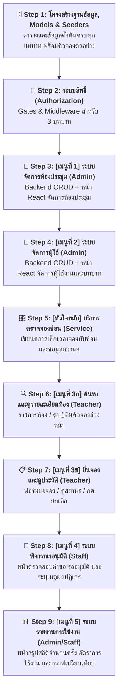
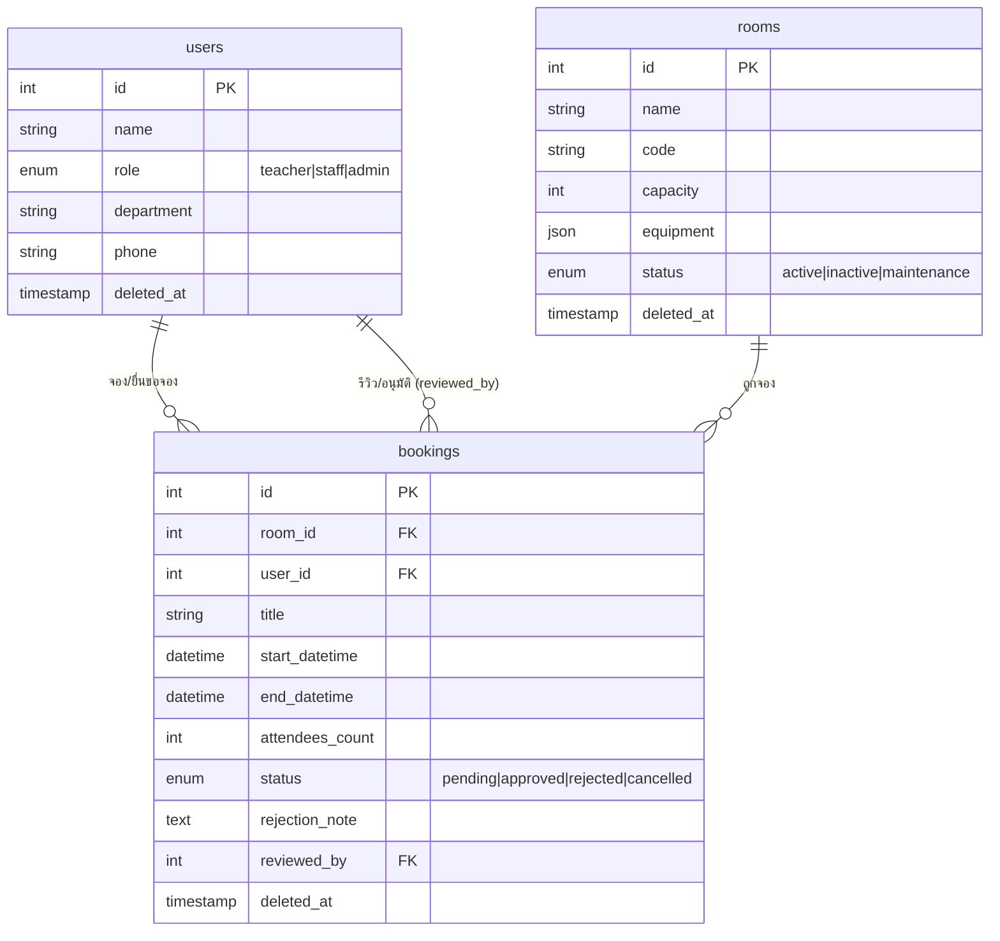

# 📋 ระบบจองห้องประชุม — Workshop MVP (เน้นเมนู CRUD ที่จำเป็นก่อน)

> **Workshop เสริมจาก Part 2 — AI-Assisted Development**  
> ลงมือสร้างระบบจองห้องประชุมสำหรับองค์กรด้วย AI Agent (เช่น Claude Code หรือ Antigravity CLI)  
> 💡 **แนวคิดสำคัญ:** ผู้เรียนไม่ต้องเขียนโค้ดเอง! เราจะใช้ **Laravel Boost AI** (Skills + MCP) ในการสร้างระบบ CRUD ที่ง่ายที่สุด (MVP) ให้เสร็จและเห็นผลลัพธ์การจองได้จริงก่อน จากนั้นจึงค่อยเสริมฟีเจอร์ส่งเมล (Mail) และแจ้งเตือน (Notification) ทีหลัง

---

## 🔧 สิ่งที่ต้องเตรียมก่อนเริ่ม (Prerequisites)

> Workshop นี้ต่อจาก **[01-lesson.md](./01-lesson.md) — Part 1 & Part 2** ทำให้ครบก่อน:
> - **โปรเจกต์ Laravel:** สร้างด้วย `laravel new` เลือก React Starter Kit + SQLite + Laravel Boost (ดู Section 3)
> - **ระบบ Auth:** Breeze ถูกติดตั้งอัตโนมัติพร้อม `laravel new` — ไม่ต้องลงซ้ำ (ดู Section 17)
> - **Laravel Boost AI เชื่อมแล้ว:** รัน `php artisan boost:install` เรียบร้อยแล้ว (ดู Section 23)
> - **Dev Server กำลังรัน:** เปิด `composer run dev` ค้างไว้ใน Terminal แยก

---

## 🧠 บทเรียนสำคัญสำหรับผู้เรียน: "ทำไมเมื่อ AI มี Skill แล้ว จึงไม่จำเป็นต้องสั่งละเอียด?"

ในการพัฒนาซอฟต์แวร์ยุคดั้งเดิม หรือแม้กระทั่งการคุยกับ AI Chat ทั่วไป ผู้ใช้มักจะต้องเขียน Prompt ยาวเหยียดเพื่ออธิบายวิธีการเขียนฐานข้อมูล วิธีการทำ Soft Deletes หรือวิธีกรอกแบบฟอร์มให้ปลอดภัย แต่ในเวิร์กชอปนี้เราจะสอนหัวใจสำคัญของ **AI-First Development** นั่นคือ:

### 1. "Less is More" — ยิ่งสั่งสั้น AI ยิ่งทำงานดีขึ้น
เมื่อ AI Agent ได้รับการติดตั้ง **Laravel Boost AI** เข้าไปในระบบ มันจะเปรียบเสมือน **"วิศวกรอาวุโส (Senior Developer)"** ที่มีคู่มือเขียนโค้ดมาตรฐานขององค์กรอยู่ในหัวอยู่แล้ว:
* **รู้มาตรฐานอยู่แล้ว:** รู้ว่าต้องทำ Soft Deletes อย่างไร รู้ว่าต้องแคสข้อมูล JSON อย่างไร หรือวิธีกระชับความปลอดภัยด้วย Middleware
* **ลดโอกาสสับสน:** การป้อน Prompt ที่ยาวและละเอียดเกินไป บางครั้งอาจทำให้ AI หันไปโฟกัสกับเรื่องย่อยๆ ที่ไม่จำเป็น หรือสร้างคำสั่งที่ขัดแย้งกับสถาปัตยกรรมระบบเดิม
* **โฟกัสที่ผลลัพธ์ (Goal-Oriented):** ผู้เรียนเพียงแค่บอกความต้องการเชิงธุรกิจ (What) เช่น *"อยากได้ฟอร์มจองห้อง ตรวจสอบเวลาซ้ำ"* และปล่อยให้ AI จัดการวิธีการเขียนโค้ดเชิงลึก (How) ให้สอดคล้องกับมาตรฐานของโปรเจกต์เอง

### 2. เปลี่ยนผู้เรียนจาก "คนเขียนโค้ด" เป็น "สถาปนิกควบคุมระบบ"
* สำหรับผู้เรียนที่ไม่ได้เก่งทางเทคนิค (Non-Technical Learners) แนวคิดนี้ช่วยทลายกำแพงความกลัวเรื่องไวยากรณ์ภาษาคอมพิวเตอร์ (Syntax)
* ผู้เรียนจะเข้าใจว่าสิ่งที่สำคัญที่สุดในยุค AI ไม่ใช่การนั่งจำคำสั่ง PHP หรือ React แต่เป็น **"การเข้าใจขั้นตอนการทำงาน (Logic Flow) ของธุรกิจ"** และความสามารถในการ **"ตรวจสอบผลลัพธ์ว่าถูกต้องหรือไม่"**

---

## 📌 แผนผังการเรียนรู้เวอร์ชัน MVP (Core CRUD Path)



---

## 1. ภาพรวมระบบ & โครงสร้างข้อมูลอย่างง่าย (MVP Database Schema) {#schema}

ในระบบนี้ เราจะลดตารางข้อมูลลงเหลือเพียง **3 ตารางหลัก** เพื่อให้เข้าใจง่ายที่สุด โดยเก็บข้อมูลการอนุมัติและข้อความปฏิเสธไว้ในตาราง bookings โดยตรง!

### 📊 แผนผังฐานข้อมูล (ER Diagram - 3 Tables)



### 🗺️ รายการหน้าจอระบบ (MVP Page Map)

| บทบาทผู้ใช้ | หน้าจอเมนูหลัก (React) | หน้าที่การทำงาน (CRUD) |
|:---|:---|:---|
| **Admin (ผู้ดูแล)** | `Admin/Rooms/Index` และ `Form` | จัดการเพิ่ม แก้ไข ปิดปรับปรุง และซอฟต์ลบห้องประชุม (Rooms CRUD) |
| **Admin (ผู้ดูแล)** | `Admin/Users/Index` และ `Form` | จัดการข้อมูลผู้ใช้ กำหนดบทบาท แผนก เบอร์โทรศัพท์ และซอฟต์ลบผู้ใช้งาน (Users CRUD) |
| **ทุกคนที่ล็อกอิน** | `Rooms/Index` และ `Rooms/Show` | ค้นหาห้องประชุม ดูอุปกรณ์ และเปิดเช็กปฏิทินวันเวลาที่โดนจองไปแล้ว |
| **Teacher (ผู้จอง)** | `Bookings/Create` และ `Bookings/Index` | ยื่นแบบฟอร์มขอจองห้อง และเช็กสถานะการจองส่วนตัว หรือกดยกเลิกจอง |
| **Staff (ผู้พิจารณา)** | `Staff/Bookings/Pending` | เปิดเช็กคิวจองที่รออนุมัติ กดปุ่มอนุมัติ หรือกรอกเหตุผลเพื่อปฏิเสธคำขอ |
| **Admin & Staff** | `Admin/Reports/Index` หรือ `Staff/Reports/Index` | ดูสถิติสรุปการใช้งานห้องประชุม อัตราความสำเร็จ และจำนวนชั่วโมงใช้งานสะสม (Usage Report & Charts) |

---

## 2. ขั้นตอนปฏิบัติการ Workshop (9 Steps - CRUD และรายงาน) {#steps}

เราจะแยกขั้นตอนการพัฒนาออกเป็น **เมนูย่อยทีละเรื่อง** โดยให้แต่ละเมนูเสร็จสมบูรณ์ทั้งฝั่งระบบหลังบ้าน (Backend) และหน้าต่างแสดงผล (Frontend React) เพื่อให้ผู้เรียนสามารถรันบิลด์แล้วทดสอบทดลองระบบจริงได้ทันทีครับ:

---

### 🗄️ Step 1: โครงสร้างฐานข้อมูล, Models และ Seeders (Database & Seeders) {#step-1}
* **เป้าหมาย:** สร้างตารางข้อมูลหลักและเซ็ตข้อมูลบัญชีทดสอบ 3 บทบาท รวมถึงห้องประชุมเริ่มต้นและคิวจองตัวอย่างในทุกสถานะ เพื่อให้ระบบมีข้อมูลพล็อตในหน้าจอได้ทันที
* **⚡ Short Prompt:**
  ```text
  สร้าง migrations และ models ของระบบจองห้องประชุม: users (เพิ่ม role enum [teacher, staff, admin], department, phone, soft deletes), rooms, และ bookings จากนั้นสร้าง UserSeeder (บัญชีบทบาทละ 1 คน รหัสผ่าน password), RoomSeeder (สร้าง 5 ห้องตัวอย่าง), และ BookingSeeder (สร้างคิวจองตัวอย่างครบทุกสถานะ: pending ×3, approved ×2, rejected ×1) ผูกเข้า DatabaseSeeder ตามลำดับ User → Room → Booking แล้วสั่งรัน migrate และ db:seed
  ```
* **🔍 วิธีตรวจสอบ:** ตรวจเช็กสถานะตารางข้อมูลและลองล็อกอินด้วยบัญชีทดสอบ:
  - **Teacher:** `teacher@example.com` | รหัสผ่าน `password`
  - **Staff:** `staff@example.com` | รหัสผ่าน `password`
  - **Admin:** `admin@example.com` | รหัสผ่าน `password`

> 💾 **ถ้าข้อมูลหาย:** รัน `php artisan db:seed` เพื่อกู้คืนข้อมูลทดสอบทั้งหมด

---

### 🔐 Step 2: ระบบสิทธิ์การเข้าถึง (Authorization — Gates & Middleware) {#step-2}
* **เป้าหมาย:** กำหนดสิทธิ์การเข้าถึงสำหรับ 3 บทบาท (admin, staff, teacher) ให้เรียบร้อยก่อนสร้าง Controller เพื่อให้ทุก routes ที่สร้างในขั้นตอนถัดไปสามารถป้องกันสิทธิ์ได้ทันที
* **⚡ Short Prompt:**
  ```text
  สร้าง Gate ใน App\Providers\AppServiceProvider สำหรับตรวจสิทธิ์ 3 บทบาท (admin, staff, teacher) โดยอ่านจากฟิลด์ role ในตาราง users และสร้าง Middleware ชื่อ EnsureRole ลงทะเบียนใน bootstrap/app.php เพื่อป้องกันเส้นทาง routes ตามบทบาทที่กำหนด
  ```
* **🔍 วิธีตรวจสอบ:** ลองเข้า URL ที่จะสร้างในขั้นตอนถัดไป เช่น `/admin/rooms` โดยล็อกอินด้วยบัญชี teacher — ระบบต้องแสดงหน้า 403 Forbidden ทันที

> 💾 **ถ้าข้อมูลหาย:** รัน `php artisan db:seed` เพื่อกู้คืนข้อมูลทดสอบทั้งหมด

---

### 👑 Step 3: [เมนูที่ 1] ระบบจัดการข้อมูลห้องประชุมสำหรับแอดมิน (Admin's Rooms CRUD) {#step-3}
* **เป้าหมาย:** สร้างระบบสำหรับผู้ดูแล (Admin) ในการเพิ่ม ลบ แก้ไขห้องประชุม ทั้งส่วนของ Controller และหน้าจอ React
* **⚡ Short Prompt:**
  ```text
  สร้าง Admin\RoomController สำหรับทำ CRUD จัดการตารางห้องประชุม (มีปุ่มสร้าง, แก้ไข, ลบชั่วคราว soft delete, และกู้คืน restore) กำหนดสิทธิ์และ routes ใน web.php และสร้างหน้า React: Admin/Rooms/Index.jsx (ตารางจัดการห้อง) และ Admin/Rooms/Form.jsx (แบบฟอร์มเพิ่ม/แก้ไขห้อง) พร้อมอัปเดตเมนูหลักใน AuthenticatedLayout.jsx
  ```
* **🔍 วิธีตรวจสอบ:** ล็อกอินเข้าใช้งานด้วยบัญชี `admin@example.com` แล้วไปที่เมนูจัดการห้อง ลองกดสร้าง แก้ไข หรือลบห้องประชุม และตรวจสอบการเปลี่ยนแปลงบนตาราง

> 💾 **ถ้าข้อมูลหาย:** รัน `php artisan db:seed` เพื่อกู้คืนข้อมูลทดสอบทั้งหมด

---

### 👥 Step 4: [เมนูที่ 2] ระบบจัดการข้อมูลผู้ใช้งานสำหรับแอดมิน (Admin's Users CRUD) {#step-4}
* **เป้าหมาย:** สร้างระบบสำหรับผู้ดูแล (Admin) ในการเพิ่ม ลบ แก้ไข และกำหนดบทบาทผู้ใช้งานในระบบ (เช่น ครู, เจ้าหน้าที่, หรือผู้ดูแลระบบ) ทั้งส่วนของ Controller และหน้าจอ React
* **⚡ Short Prompt:**
  ```text
  สร้าง Admin\UserController สำหรับทำ CRUD จัดการข้อมูลผู้ใช้งาน (มีปุ่มสร้างผู้ใช้ใหม่พร้อมเข้ารหัสผ่าน, แก้ไขชื่อ/บทบาท/แผนก/เบอร์โทรศัพท์, ลบชั่วคราว soft delete, และกู้คืน restore) กำหนดเส้นทาง routes ใน web.php ภายใต้กลุ่มสิทธิ์ admin และสร้างหน้า React: Admin/Users/Index.jsx (ตารางจัดการรายชื่อผู้ใช้) และ Admin/Users/Form.jsx (แบบฟอร์มเพิ่ม/แก้ไขผู้ใช้งาน) พร้อมอัปเดตเมนูนำทางใน AuthenticatedLayout.jsx
  ```
* **🔍 วิธีตรวจสอบ:** ล็อกอินเข้าใช้งานด้วยบัญชี `admin@example.com` ไปที่เมนูจัดการผู้ใช้งาน ทดลองเพิ่มบัญชีครูคนใหม่ หรือแก้ไขเปลี่ยนบทบาทจากครูเป็นเจ้าหน้าที่ (Staff) และลองทดสอบการเข้าถึงของสิทธิ์นั้นๆ

> 💾 **ถ้าข้อมูลหาย:** รัน `php artisan db:seed` เพื่อกู้คืนข้อมูลทดสอบทั้งหมด

---

### 🎛️ Step 5: [บริการหลัก] บริการตรวจเช็คระบบคิวจองทับซ้อน (Booking Overlap Service) {#step-5}
* **เป้าหมาย:** เขียนตรรกะหัวใจหลักของการป้องกันจองซ้ำ เพื่อเป็นตัวช่วยตรวจสอบก่อนส่งข้อมูลการจองบันทึกเข้าสู่ฐานข้อมูล
* **📊 แผนภาพการเปรียบเทียบเวลาจองทับซ้อน (Time Overlapping Cases):**
  ```mermaid
  gantt
      title กรณีจองเวลาซ้อนกัน (Overlap) ทั้ง 4 แบบที่ระบบต้องป้องกัน
      dateFormat YYYY-MM-DD HH:mm
      axisFormat %H:%M

      section คิวจองเดิมในฐานข้อมูล
      การจองเดิม (10.00-12.00) :active, 2024-01-01 10:00, 2h

      section คนใหม่ยื่นจอง Case 1
      ทับช่วงท้าย (11.00-13.00) :crit, 2024-01-01 11:00, 2h

      section คนใหม่ยื่นจอง Case 2
      ทับช่วงต้น (09.00-11.00) :crit, 2024-01-01 09:00, 2h

      section คนใหม่ยื่นจอง Case 3
      ครอบทั้งหมด (09.00-13.00) :crit, 2024-01-01 09:00, 4h

      section คนใหม่ยื่นจอง Case 4
      ทับอยู่ข้างใน (10.30-11.30) :crit, 2024-01-01 10:30, 1h
  ```
  > [!NOTE]
  > **💡 สูตรการตรวจสอบความทับซ้อน:**
  > ระบบจะใช้หลักคิดตรรกะแบบสั้นในการคำนวณ: `เวลาเริ่มจองใหม่ < เวลาสิ้นสุดเดิม` **และ** `เวลาสิ้นสุดใหม่ > เวลาเริ่มเดิม` หากเข้าเงื่อนไขนี้แสดงว่ามีการจองชนกัน
* **⚡ Short Prompt:**
  ```text
  สร้าง app/Services/BookingService.php เพื่อเขียนตรรกะตรวจสอบเวลาจองซ้อนทับกัน (overlap), ตรวจสอบห้องว่าพร้อมใช้งานหรือไม่ (status active), และตรวจสอบจำนวนคนเข้าร่วมไม่ให้เกินความจุของห้องประชุม (capacity)
  ```

---

### 🔍 Step 6: [เมนูที่ 3ก] ค้นหาและดูรายละเอียดห้องประชุม (Room Browsing) {#step-6}
* **เป้าหมาย:** สร้างหน้าสืบค้นข้อมูลห้องสำหรับทุกคนที่ล็อกอิน พร้อมหน้ารายละเอียดที่แสดงปฏิทินคิวจองล่วงหน้า เพื่อให้ครูตรวจสอบว่าห้องว่างก่อนยื่นจอง
* **⚡ Short Prompt:**
  ```text
  สร้าง RoomController พร้อม routes สำหรับทุก user ที่ล็อกอิน และสร้างหน้า React: Rooms/Index.jsx (การ์ดรายการห้องพร้อมฟิลเตอร์) และ Rooms/Show.jsx (รายละเอียดห้องพร้อมปฏิทินแสดงคิวจองล่วงหน้า) พร้อมอัปเดตเมนูนำทางใน AuthenticatedLayout.jsx
  ```
* **🔍 วิธีตรวจสอบ:** ล็อกอินด้วยบัญชี `teacher@example.com` ไปที่เมนูห้องประชุม ตรวจสอบว่าเห็นรายการห้องทั้งหมด และเมื่อคลิกเข้าห้องใดห้องหนึ่งจะเห็นปฏิทินแสดงคิวจองที่มีอยู่แล้วจาก BookingSeeder

> 💾 **ถ้าข้อมูลหาย:** รัน `php artisan db:seed` เพื่อกู้คืนข้อมูลทดสอบทั้งหมด

---

### 📋 Step 7: [เมนูที่ 3ข] ยื่นจองและดูประวัติการจอง (Booking CRUD) {#step-7}
* **เป้าหมาย:** สร้างระบบยื่นจองที่เรียกใช้ BookingService ตรวจสอบก่อนบันทึก พร้อมหน้าประวัติที่แสดงสถานะคิวจองและปุ่มยกเลิก
* **⚡ Short Prompt:**
  ```text
  สร้าง BookingController เรียกใช้ BookingService ตรวจ overlap ก่อนบันทึก รองรับการยกเลิก (teacher เจ้าของเท่านั้น) กำหนดสิทธิ์และ routes สำหรับ teacher และสร้างหน้า React: Bookings/Create.jsx (ฟอร์มยื่นจองพร้อม validation แจ้งเตือนสีแดงเมื่อเวลาซ้อน) และ Bookings/Index.jsx (ประวัติคิวจองพร้อมแสดงสถานะและเหตุผลปฏิเสธ)
  ```
* **🔍 วิธีตรวจสอบ:** ล็อกอินด้วยบัญชี `teacher@example.com` ลองกรอกฟอร์มจองห้อง — หากระบุเวลาซ้ำกับคิวเดิมระบบต้องแจ้งข้อผิดพลาดสีแดงทันที เมื่อจองสำเร็จคิวจะแสดงสถานะสีเหลืองว่า **"⏳ รออนุมัติ"**

> 💾 **ถ้าข้อมูลหาย:** รัน `php artisan db:seed` เพื่อกู้คืนข้อมูลทดสอบทั้งหมด

---

### 👮 Step 8: [เมนูที่ 4] ระบบตรวจสอบและพิจารณาอนุมัติคิวจอง (Staff's Approvals) {#step-8}
* **เป้าหมาย:** ระบบคัดกรองและอนุมัติคิวจองสำหรับเจ้าหน้าที่ (Staff) โดยสามารถกดตอบรับคำขอ หรือกรอกเหตุผลระบุข้อปฏิเสธกลับไปให้ผู้ขอยื่นจองทราบ
* **⚡ Short Prompt:**
  ```text
  สร้าง Staff\BookingApprovalController เพื่อดึงข้อมูลคิวจองรอตรวจ (pending) และอัปเดตสถานะ (อนุมัติ/ปฏิเสธพร้อมบันทึกเหตุผลลง bookings), กำหนดสิทธิ์และ routes, และสร้างหน้า React: Staff/Bookings/Pending.jsx (ตารางตรวจสอบคำขอจอง มีปุ่มกดอนุมัติ และปุ่มปฏิเสธที่จะเปิดกล่องป๊อปอัปให้ผู้ใช้พิมพ์เหตุผลประกอบ)
  ```
* **🔍 วิธีตรวจสอบ:** ล็อกอินด้วยบัญชี `staff@example.com` เข้าเมนูอนุมัติการจอง ลองกดปุ่มอนุมัติ หรือระบุเหตุผลเพื่อปฏิเสธคำขอ จากนั้นสลับกลับไปเช็กสถานะในบัญชีของครู (Teacher) ว่ารายการได้รับการอัปเดตตรงตามสิทธิ์แล้วหรือไม่

> 💾 **ถ้าข้อมูลหาย:** รัน `php artisan db:seed` เพื่อกู้คืนข้อมูลทดสอบทั้งหมด

---

### 📊 Step 9: [เมนูที่ 5] ระบบรายงานและสถิติการใช้งานห้องประชุม (Usage Reports & Dashboard) {#step-9}
* **เป้าหมาย:** สร้างระบบสำหรับผู้ดูแล (Admin) และเจ้าหน้าที่ (Staff) ในการเข้าถึงหน้ารายงานสถิติ เพื่อวิเคราะห์ข้อมูลการใช้ห้องประชุม อัตราการอนุมัติ และชั่วโมงการใช้งานรวมแยกตามห้องประชุม
* **⚡ Short Prompt:**
  ```text
  สร้าง Admin\ReportController ดึงข้อมูลสถิติการจองห้องประชุม (ประกอบด้วย: 1. จำนวนครั้งที่จองห้องสำเร็จแยกตามห้อง 2. สัดส่วนสถานะการจองทั้งหมด pending/approved/rejected/cancelled 3. ชั่วโมงการใช้งานสะสมแยกตามห้องโดยคำนวณจากเวลาเริ่มและสิ้นสุดของการจองที่อนุมัติแล้ว) กำหนดสิทธิ์และ routes ใน web.php ให้เฉพาะ admin และ staff เข้าถึงได้ และสร้างหน้า React: Admin/Reports/Index.jsx แสดงการ์ดสรุปตัวเลขสำคัญ (KPIs Cards) กราฟแท่ง (Bar Chart) อย่างง่ายด้วย CSS หรือ SVG และตารางแจกแจงสถิติแยกรายห้อง พร้อมปุ่มพิมพ์รายงาน (Window Print) และอัปเดตเมนูนำทางใน AuthenticatedLayout.jsx ให้แสดงเมนูรายงานนี้เฉพาะผู้ใช้ที่มี role เป็น admin หรือ staff เท่านั้น
  ```
* **🔍 วิธีตรวจสอบ:** ล็อกอินเข้าใช้งานด้วยบัญชี `admin@example.com` หรือ `staff@example.com` แล้วไปที่เมนูรายงานการใช้งานห้องประชุม ตรวจสอบข้อมูลสถิติว่ามีการคำนวณและดึงข้อมูลจากการจองในอดีตขึ้นมาแสดงผลถูกต้อง และสามารถกดปุ่มพิมพ์รายงานเพื่อตรวจสอบความสมบูรณ์ของหน้าเอกสารตอน Print Preview ได้

> 💾 **ถ้าข้อมูลหาย:** รัน `php artisan db:seed` เพื่อกู้คืนข้อมูลทดสอบทั้งหมด

---

## 3. ตารางตรวจสอบผลงานความสำเร็จ (MVP Verification Checklist) {#checklist}

### 💡 ขั้นตอนสำคัญ: การเริ่มต้นเซิร์ฟเวอร์ (Dev Servers)
ในขั้นตอนนี้ ผู้เรียนจำเป็นต้องรันเซิร์ฟเวอร์ระบบ Backend และ Frontend ควบคู่กันเสมอเพื่อให้เว็บสามารถแสดงผลหน้า React SPA ได้อย่างสมบูรณ์:

* **วิธีที่ 1 (คำสั่งลัดคำสั่งเดียว):**
  ```bash
  composer run dev
  ```
  *(คำสั่งลัดนี้จะทำการเปิดใช้งานทั้ง PHP Artisan Serve และ Vite Dev Server พร้อมกันทางเบื้องหลัง)*

* **วิธีที่ 2 (เปิด 2 หน้าต่างกรณีวิธีแรกทำงานไม่สมบูรณ์):**
  * **หน้าต่างที่ 1:** รันเซิร์ฟเวอร์ Backend
    ```bash
    php artisan serve
    ```
  * **หน้าต่างที่ 2:** รัน Vite สำหรับ React SPA
    ```bash
    npm run dev
    ```

เปิดเบราว์เซอร์ไปที่ `http://127.0.0.1:8000` และทดลองตรวจระบบ CRUD ของแต่ละบทบาทตามลำดับ:

| บทบาทผู้ทำรายการ | การดำเนินการทดสอบ | สิ่งที่ระบบต้องแสดงผลลัพธ์ได้อย่างถูกต้อง | ผ่าน |
|:---|:---|:---|:---:|
| **Teacher (ผู้จอง)** | ล็อกอิน `teacher@example.com` -> ลองเข้า URL `/admin/rooms` โดยตรง | ระบบต้องแสดงหน้า 403 Forbidden ทันที ไม่อนุญาตให้เข้าถึง | [ ] |
| **Admin (ผู้ดูแล)** | ล็อกอิน `admin@example.com` -> เมนูจัดการห้อง -> ลองเพิ่มห้องประชุมใหม่และบันทึก | ห้องที่เพิ่มจะขึ้นโชว์ในตาราง สามารถแก้ไขข้อมูล หรือกดลบชั่วคราว (Soft Delete) และกู้คืนกลับมาได้ | [ ] |
| **Admin (ผู้ดูแล)** | ล็อกอิน `admin@example.com` -> เมนูจัดการผู้ใช้ -> ลองเพิ่มบัญชีคุณครูคนใหม่ หรือปรับบทบาทผู้ใช้ | รายชื่อผู้ใช้แสดงผลในตาราง สามารถแก้ไขชื่อ สังกัด แผนก เบอร์โทรศัพท์ บทบาท และกดลบ (Soft Delete) คืนสภาพได้ | [ ] |
| **Teacher (ผู้จอง)** | ล็อกอิน `teacher@example.com` -> เมนูห้องประชุม -> คลิกเข้าดูรายละเอียดห้อง | เห็นรายการห้องทั้งหมด และเมื่อคลิกเข้าห้องจะเห็นปฏิทินแสดงคิวจองที่มีอยู่แล้ว | [ ] |
| **Teacher (ผู้จอง)** | ล็อกอิน `teacher@example.com` -> เลือกห้องและกรอกฟอร์มจอง | ข้อมูลต้องผ่านการกรอง (หากจองซ้ำเวลาเดิมระบบต้องแจ้งเตือนสีแดง) เมื่อจองสำเร็จคิวจะแสดงสถานะสีเหลืองว่า **"⏳ รออนุมัติ"** | [ ] |
| **Staff (ผู้ตรวจสอบ)** | ล็อกอิน `staff@example.com` -> เมนูอนุมัติการจอง -> ตรวจสอบการจองของครู | จะเห็นข้อมูลการจองปรากฏเด่นชัด สามารถกดอนุมัติได้ทันที หรือกดปฏิเสธโดยจะเปิดกล่องข้อความบังคับให้กรอกเหตุผล | [ ] |
| **Teacher (ผู้จอง)** | กลับมาล็อกอินบัญชี Teacher อีกครั้ง เพื่อดูหน้าประวัติการจองของตนเอง | สถานะเปลี่ยนไปตามที่ Staff พิจารณา (เช่นขึ้นสัญลักษณ์สีแดง **"❌ ถูกปฏิเสธ"** พร้อมโชว์เหตุผลที่กรอกชัดเจนใต้แถว) | [ ] |
| **Admin & Staff** | ล็อกอิน `admin@example.com` หรือ `staff@example.com` -> เมนูรายงานการใช้งาน | สถิติการใช้งานห้องและกราฟแสดงผลถูกต้อง มีปุ่มพิมพ์รายงานพร้อมใช้งาน | [ ] |

---

## 💾 บันทึก Checkpoint แรกเข้าสู่ระบบ Git

เมื่อผู้เรียนสร้างระบบ MVP สิ้นสุดลง ให้ครูชวนผู้เรียนเปิด Terminal และสั่งรันคำสั่งเหล่านี้เพื่อเซฟเก็บความสำเร็จแรกไว้ในประวัติโปรเจกต์:

```bash
git add .
git commit -m "feat: complete core meeting room booking CRUD system (MVP)"
```

> **🎉 ยินดีด้วย!** ระบบหลัก CRUD ทั้งหมดทำงานประสานกันสมบูรณ์แล้วในเวลาอันรวดเร็ว!
> ในช่วงถัดไป (Phase 2) เราจะมาทำความรู้จักกับระบบกระดิ่งเตือน (In-App Notification) และระบบอีเมล (Mail Alert) เพื่อนำมาบูรณาการฝังต่อยอดลงไปในซอร์สโค้ดเดิมนี้กันครับ!

---

## 4. ถัดไป: Phase 2 — ระบบแจ้งเตือนและอีเมล

ดำเนินการต่อได้ที่ **[03-workshop-phase2.md](./03-workshop-phase2.md)**

ครอบคลุม:
- ติดตั้งและใช้งาน **Mailpit** บน WSL สำหรับทดสอบอีเมลในเครื่อง
- **In-App Notification** (กระดิ่งแจ้งเตือน) เมื่อสถานะจองเปลี่ยน
- **Mail Alert** อีเมลยืนยันการจองและแจ้งผลอนุมัติ
