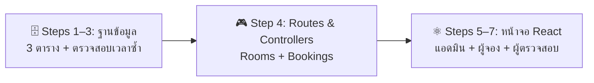
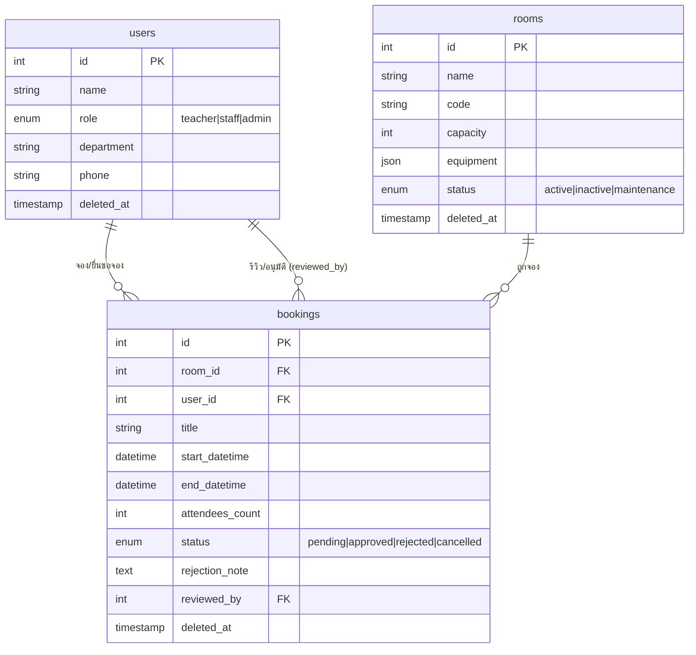

# 📋 ระบบจองห้องประชุม — Workshop MVP (เน้นเมนู CRUD ที่จำเป็นก่อน)

> **Workshop เสริมจาก Part 2 — AI-Assisted Development**  
> ลงมือสร้างระบบจองห้องประชุมสำหรับองค์กรด้วย AI Agent (เช่น Claude Code หรือ Antigravity CLI)  
> 💡 **แนวคิดสำคัญ:** ผู้เรียนไม่ต้องเขียนโค้ดเอง! เราจะใช้ **Laravel Boost AI** (Skills + MCP) ในการสร้างระบบ CRUD ที่ง่ายที่สุด (MVP) ให้เสร็จและเห็นผลลัพธ์การจองได้จริงก่อน จากนั้นจึงค่อยเสริมฟีเจอร์ส่งเมล (Mail) และแจ้งเตือน (Notification) ทีหลัง

---

## 🔧 สิ่งที่ต้องเตรียมก่อนเริ่ม (Prerequisites)

> Workshop นี้ต่อจาก **[01-lesson.md](./01-lesson.md) — Part 1 & Part 2** ทำให้ครบก่อน:
> - **โปรเจกต์ Laravel:** สร้างด้วย `laravel new` เลือก React Starter Kit + SQLite + Laravel Boost (ดู Section 3)
> - **ระบบ Auth:** Breeze ถูกติดตั้งอัตโนมัติพร้อม `laravel new` — ไม่ต้องลงซ้ำ (ดู Section 17)
> - **Laravel Boost AI เชื่อมแล้ว:** รัน `php artisan boost:install` เรียบร้อยแล้ว (ดู Section 24)
> - **Dev Server กำลังรัน:** เปิด `composer run dev` ค้างไว้ใน Terminal แยก

---

## 🧠 บทเรียนสำคัญสำหรับผู้เรียน: "ทำไมเมื่อ AI มี Skill แล้ว จึงไม่จำเป็นต้องสั่งละเอียด?"

ในการพัฒนาซอฟต์แวร์ยุคดั้งเดิม หรือแม้กระทั่งการคุยกับ AI Chat ทั่วไป ผู้ใช้มักจะต้องเขียน Prompt ยาวเหยียดเพื่ออธิบายวิธีการเขียนฐานข้อมูล วิธีการทำ Soft Deletes หรือวิธีกรอกแบบฟอร์มให้ปลอดภัย แต่ในเวิร์กชอปนี้เราจะสอนหัวใจสำคัญของ **AI-First Development** นั่นคือ:

### 1. "Less is More" — ยิ่งสั่งสั้น AI ยิ่งทำงานดีขึ้น
เมื่อ AI Agent ได้รับการติดตั้ง **Laravel Boost AI** เข้าไปในระบบ มันจะเปรียบเสมือน **"วิศวกรอาวุโส (Senior Developer)"** ที่มีคู่มือเขียนโค้ดมาตรฐานขององค์กรอยู่ในหัวอยู่แล้ว:
* **รู้มาตรฐานอยู่แล้ว:** รู้ว่าต้องทำ Soft Deletes อย่างไร รู้ว่าต้องแคสข้อมูล JSON อย่างไร หรือวิธีกระชับความปลอดภัยด้วย Middleware
* **ลดโอกาสสับสน:** การป้อน Prompt ที่ยาวและละเอียดเกินไป บางครั้งอาจทำให้ AI หันไปโฟกัสกับเรื่องย่อยๆ ที่ไม่จำเป็น หรือสร้างคำสั่งที่ขัดแย้งกับสถาปัตยกรรมระบบเดิม
* **โฟกัสที่ผลลัพธ์ (Goal-Oriented):** ผู้เรียนเพียงแค่บอกความต้องการเชิงธุรกิจ (What) เช่น *"อยากได้ฟอร์มจองห้อง ตรวจสอบเวลาซ้ำ"* และปล่อยให้ AI จัดการวิธีการเขียนโค้ดเชิงลึก (How) ให้สอดคล้องกับมาตรฐานของโปรเจกต์เอง

### 2. เปลี่ยนผู้เรียนจาก "คนเขียนโค้ด" เป็น "สถาปนิกควบคุมระบบ"
* สำหรับผู้เรียนที่ไม่ได้เก่งทางเทคนิค (Non-Technical Learners) แนวคิดนี้ช่วยทลายกำแพงความกลัวเรื่องไวยากรณ์ภาษาคอมพิวเตอร์ (Syntax)
* ผู้เรียนจะเข้าใจว่าสิ่งที่สำคัญที่สุดในยุค AI ไม่ใช่การนั่งจำคำสั่ง PHP หรือ React แต่เป็น **"การเข้าใจขั้นตอนการทำงาน (Logic Flow) ของธุรกิจ"** และความสามารถในการ **"ตรวจสอบผลลัพธ์ว่าถูกต้องหรือไม่"**

---

## 📌 แผนผังการเรียนรู้เวอร์ชัน MVP (Core CRUD Path)



---

## 1. ภาพรวมระบบ & โครงสร้างข้อมูลอย่างง่าย (MVP Database Schema)

ในระบบนี้ เราจะลดตารางข้อมูลลงเหลือเพียง **3 ตารางหลัก** เพื่อให้เข้าใจง่ายที่สุด โดยเก็บข้อมูลการอนุมัติและข้อความปฏิเสธไว้ในตาราง bookings โดยตรง!

### 📊 แผนผังฐานข้อมูล (ER Diagram - 3 Tables)



### 🗺️ รายการหน้าจอระบบ (MVP Page Map)

| บทบาทผู้ใช้ | หน้าจอเมนูหลัก (React) | หน้าที่การทำงาน (CRUD) |
|:---|:---|:---|
| **Admin (ผู้ดูแล)** | `Admin/Rooms/Index` และ `Form` | จัดการเพิ่ม แก้ไข ปิดปรับปรุง และซอฟต์ลบห้องประชุม (Rooms CRUD) |
| **ทุกคนที่ล็อกอิน** | `Rooms/Index` และ `Rooms/Show` | ค้นหาห้องประชุม ดูอุปกรณ์ และเปิดเช็กปฏิทินวันเวลาที่โดนจองไปแล้ว |
| **Teacher (ผู้จอง)** | `Bookings/Create` และ `Bookings/Index` | ยื่นแบบฟอร์มขอจองห้อง และเช็กสถานะการจองส่วนตัว หรือกดยกเลิกจอง |
| **Staff (ผู้พิจารณา)** | `Staff/Bookings/Pending` | เปิดเช็กคิวจองที่รออนุมัติ กดปุ่มอนุมัติ หรือกรอกเหตุผลเพื่อปฏิเสธคำขอ |

---

## 2. ขั้นตอนปฏิบัติการ Workshop (7 Steps with Short Prompts)

---

### 🗄️ Phase 1: การเตรียมโครงสร้างระบบและฐานข้อมูล

#### Step 1: สร้างฐานข้อมูลและ Eloquent Models (P-01)
* **เป้าหมาย:** สร้างตารางข้อมูล 3 ตารางหลัก ได้แก่ users (อัปเดตฟิลด์เพิ่ม), rooms และ bookings (รองรับคอลัมน์เก็บข้อมูลการพิจารณาอนุมัติ)
* **⚡ Short Prompt:**
  ```text
  สร้าง migrations และ models ของระบบจองห้องประชุมอย่างง่าย: users (เพิ่ม role enum, department, phone, soft deletes), rooms, และ bookings (เก็บ room_id, user_id, title, start_datetime, end_datetime, attendees_count, status enum, rejection_note, reviewed_by, soft deletes พร้อมทำ index) จากนั้นสั่งรัน migrate
  ```
* **🔍 วิธีตรวจสอบ:** ตรวจเช็กสถานะตารางข้อมูลในระบบหลังบ้าน:
  ```bash
  php artisan db:show
  ```

---

#### Step 2: ข้อมูลจำลองสำหรับทดสอบระบบ (P-02)
* **เป้าหมาย:** สร้างข้อมูลบัญชีตัวอย่าง 3 คน (Teacher, Staff, Admin) และห้องประชุม 5 ห้อง เพื่อให้นำไปทดสอบจองได้จริงทันที
* **⚡ Short Prompt:**
  ```text
  สร้าง UserSeeder (สร้าง 3 roles: teacher, staff, admin บัญชีรหัสผ่าน password) และ RoomSeeder (สร้าง 5 ห้องตัวอย่างพร้อม equipment JSON) และผูกเข้า DatabaseSeeder พร้อมสั่งรัน db:seed
  ```
* **🔍 วิธีตรวจสอบ:** ทดลองล็อกอินเข้าเว็บด้วยบัญชีตัวอย่าง:
  * **Teacher:** `teacher@example.com` | รหัสผ่าน: `password`
  * **Staff:** `staff@example.com` | รหัสผ่าน: `password`
  * **Admin:** `admin@example.com` | รหัสผ่าน: `password`

---

#### Step 3: บริการคัดกรองการจองทับซ้อน (BookingService) (P-03)
* **เป้าหมาย:** เขียนตรรกะตรวจสอบเวลาการจองซ้อนกันของห้องเดียวกัน ป้องกันการจองห้องปิดซ่อม และเช็กยอดคนเข้าเกินความจุห้อง
* **📊 แผนภาพการเปรียบเทียบเวลาจองทับซ้อน (Time Overlapping Cases):**

```mermaid
gantt
    title กรณีจองเวลาซ้อนกัน (Overlap) ทั้ง 4 แบบที่ระบบต้องป้องกัน
    dateFormat HH:mm
    axisFormat %H:%M

    section คิวจองเดิมในฐานข้อมูล
    การจองเดิม (10:00 - 12:00) :active, 10:00, 2h

    section คนใหม่ยื่นจอง Case 1
    ทับช่วงท้าย (11:00 - 13:00) :crit, 11:00, 2h

    section คนใหม่ยื่นจอง Case 2
    ทับช่วงต้น (09:00 - 11:00) :crit, 09:00, 2h

    section คนใหม่ยื่นจอง Case 3
    ครอบทั้งหมด (09:00 - 13:00) :crit, 09:00, 4h

    section คนใหม่ยื่นจอง Case 4
    ทับอยู่ข้างใน (10:30 - 11:30) :crit, 10:30, 1h
```



> [!NOTE]
> **💡 หลักคิดในการเช็กช่วงเวลาทับซ้อน:**
> ระบบจะใช้สมการในการตรวจสอบว่าคิวใหม่ชนกับคิวเดิมในฐานข้อมูลหรือไม่ ด้วยหลักคิดสั้นๆ:
> `เวลาเริ่มจองใหม่ < เวลาสิ้นสุดเดิม` **และ** `เวลาสิ้นสุดใหม่ > เวลาเริ่มเดิม`
> หากเงื่อนไขนี้เป็นจริง ระบบจะตีว่า **"เวลาชนกัน"** และบล็อกไม่ให้ทำการจองทันที!

* **⚡ Short Prompt:**
  ```text
  สร้าง app/Services/BookingService.php เพื่อเก็บ logic ตรวจสอบเวลาจองซ้อนทับกัน (overlap), ตรวจสอบห้องปิดซ่อม (status), และตรวจจำนวนผู้ร่วมเกินความจุห้อง (capacity)
  ```

---


### 💻 Phase 2: ระบบจัดการการทำงาน (Controllers & Routes)

#### Step 4: สร้าง Controllers และระบบเส้นทาง (P-04)
* **เป้าหมาย:** สร้างแผงควบคุมการดึงและอัปเดตข้อมูลของฝั่งผู้จอง, เจ้าหน้าที่ และแอดมิน พร้อมลงทะเบียน middleware aliases ของระบบ
* **⚡ Short Prompt:**
  ```text
  สร้าง StoreBookingRequest (ตรวจสอบฟิลด์ภาษาไทย), RoomController (แสดงแคตตาล็อกหน้า Rooms/Index และ Rooms/Show), BookingController (ให้ครูดูคิวและกดยื่นจอง/ยกเลิก), Staff\BookingApprovalController (ดึงคิวค้าง pending, บันทึกอนุมัติ/ปฏิเสธลงตาราง bookings), และ Admin\RoomController (แอดมิน CRUD จัดการห้องพร้อมปุ่ม restore) จากนั้นสร้าง middleware สิทธิ์ staff และ admin และลงทะเบียน routes ทั้งหมดใน routes/web.php
  ```

> [!NOTE]
> **⏱ Step นี้ใช้เวลานานที่สุด** — AI ต้องสร้างหลาย Controllers พร้อมกัน หาก AI หยุดกลางทางให้ Prompt ต่อว่า `"ทำต่อจากจุดที่ค้างอยู่"`

---

### 🎨 Phase 3: หน้าจอเว็บติดต่อผู้ใช้งาน (React Views)

#### Step 5: หน้าจอค้นหาห้องและฟอร์มจองสำหรับผู้ใช้ (P-05)
* **เป้าหมาย:** พัฒนาหน้าจอแคตตาล็อกรวมการ์ดห้องประชุมพร้อมสิ่งอำนวยความสะดวก, หน้ารายละเอียดที่โชว์ตารางเวลาที่มีคิวจองล่วงหน้าแล้ว และหน้าต่างฟอร์มกรอกจอง
* **⚡ Short Prompt:**
  ```text
  สร้างหน้า React Pages: Rooms/Index.jsx (การ์ดห้องประชุมพร้อมอุปกรณ์), Rooms/Show.jsx (รายละเอียดห้องพร้อมคิวอนุมัติล่วงหน้า), และ Bookings/Create.jsx (แบบฟอร์มทำเรื่องกรอกยื่นขอจองห้อง)
  ```

---

#### Step 6: หน้าประวัติการจองและแผงพิจารณาอนุมัติ (P-06)
* **เป้าหมาย:** หน้าประวัติการจองส่วนตัวของครู (แสดงผลเหตุผลประกอบหากโดนบอกปัดปฏิเสธ) และหน้าต่างตรวจสอบของ Staff ในการกดยืนยันอนุมัติ หรือเปิดกล่องระบุเหตุผลเพื่อปฏิเสธคำขอ
* **⚡ Short Prompt:**
  ```text
  สร้างหน้า React Pages: Bookings/Index.jsx (ประวัติจองของครูพร้อมกล่องแสดงเหตุผลปฏิเสธและปุ่มยกเลิก) และ Staff/Bookings/Pending.jsx (หน้าตรวจสอบอนุมัติคิวงานของ Staff มีปุ่มกดอนุมัติ และปุ่มปฏิเสธที่จะเปิดอินพุตให้พิมพ์เหตุผลประกอบ)
  ```

---

#### Step 7: หน้าควบคุมจัดการห้องของแอดมิน (P-07)
* **เป้าหมาย:** แผง CRUD ควบคุมระบบห้องทั้งหมดของแอดมิน สามารถกรอกเพิ่ม, แก้ไขข้อมูล, กด Soft Delete ลบชั่วคราว และกดปุ่ม Restore ดึงกลับคืนสภาพเดิมได้
* **⚡ Short Prompt:**
  ```text
  สร้างหน้า React Pages ของแอดมิน: Admin/Rooms/Index.jsx (ตารางจัดการห้องประชุม CRUD มีปุ่มแก้ไข ลบชั่วคราว และปุ่ม restore คืนชีพ) และ Admin/Rooms/Form.jsx (แบบฟอร์ม 2-in-1 สำหรับเพิ่มและแก้ไขห้องประชุม) จากนั้นเชื่อมลิ้งก์เมนูนำทางและแชร์สิทธิ์ของผู้ใช้ผ่าน HandleInertiaRequests และ AuthenticatedLayout.jsx ให้ถูกต้องตามบทบาท
  ```

---

## 3. ตารางตรวจสอบผลงานความสำเร็จ (MVP Verification Checklist)

### 💡 ขั้นตอนสำคัญ: การเริ่มต้นเซิร์ฟเวอร์ (Dev Servers)
ในขั้นตอนนี้ ผู้เรียนจำเป็นต้องรันเซิร์ฟเวอร์ระบบ Backend และ Frontend ควบคู่กันเสมอเพื่อให้เว็บสามารถแสดงผลหน้า React SPA ได้อย่างสมบูรณ์:

* **วิธีที่ 1 (คำสั่งลัดคำสั่งเดียว):**
  ```bash
  composer run dev
  ```
  *(คำสั่งลัดนี้จะทำการเปิดใช้งานทั้ง PHP Artisan Serve และ Vite Dev Server พร้อมกันทางเบื้องหลัง)*

* **วิธีที่ 2 (เปิด 2 หน้าต่างกรณีวิธีแรกทำงานไม่สมบูรณ์):**
  * **หน้าต่างที่ 1:** รันเซิร์ฟเวอร์ Backend
    ```bash
    php artisan serve
    ```
  * **หน้าต่างที่ 2:** รัน Vite สำหรับ React SPA
    ```bash
    npm run dev
    ```

เปิดเบราว์เซอร์ไปที่ `http://127.0.0.1:8000` และทดลองตรวจระบบ CRUD ของแต่ละบทบาทตามลำดับ:

| บทบาทผู้ทำรายการ | การดำเนินการทดสอบ | สิ่งที่ระบบต้องแสดงผลลัพธ์ได้อย่างถูกต้อง | ผ่าน |
|:---|:---|:---|:---:|
| **Admin (ผู้ดูแล)** | ล็อกอิน `admin@example.com` -> เมนูจัดการห้อง -> ลองเพิ่มห้องประชุมใหม่และบันทึก | ห้องที่เพิ่มจะขึ้นโชว์ในตาราง สามารถแก้ไขข้อมูล หรือกดลบชั่วคราว (Soft Delete) และกู้คืนกลับมาได้ | [ ] |
| **Teacher (ผู้จอง)** | ล็อกอิน `teacher@example.com` -> เมนูห้องประชุม -> เลือกห้องประชุมและกรอกจองห้อง | ข้อมูลต้องผ่านการกรอง (หากจองซ้ำเวลาเดิมระบบต้องแจ้งเตือนสีแดง) เมื่อจองสำเร็จคิวจะแสดงสถานะสีเหลืองว่า **"⏳ รออนุมัติ"** | [ ] |
| **Staff (ผู้ตรวจสอบ)** | ล็อกอิน `staff@example.com` -> เมนูอนุมัติการจอง -> ตรวจสอบการจองของครู | จะเห็นข้อมูลการจองปรากฏเด่นชัด สามารถกดอนุมัติได้ทันที หรือกดปฏิเสธโดยจะเปิดกล่องข้อความบังคับให้กรอกเหตุผล | [ ] |
| **Teacher (ผู้จอง)** | กลับมาล็อกอินบัญชี Teacher อีกครั้ง เพื่อดูหน้าประวัติการจองของตนเอง | สถานะเปลี่ยนไปตามที่ Staff พิจารณา (เช่นขึ้นสัญลักษณ์สีแดง **"❌ ถูกปฏิเสธ"** พร้อมโชว์เหตุผลที่กรอกชัดเจนใต้แถว) | [ ] |

---

## 💾 บันทึก Checkpoint แรกเข้าสู่ระบบ Git

เมื่อผู้เรียนสร้างระบบ MVP สิ้นสุดลง ให้ครูชวนผู้เรียนเปิด Terminal และสั่งรันคำสั่งเหล่านี้เพื่อเซฟเก็บความสำเร็จแรกไว้ในประวัติโปรเจกต์:

```bash
git add .
git commit -m "feat: complete core meeting room booking CRUD system (MVP)"
```

> **🎉 ยินดีด้วย!** ระบบหลัก CRUD ทั้งหมดทำงานประสานกันสมบูรณ์แล้วในเวลาอันรวดเร็ว!
> ในช่วงถัดไป (Phase 2) เราจะมาทำความรู้จักกับระบบกระดิ่งเตือน (In-App Notification) และระบบอีเมล (Mail Alert) เพื่อนำมาบูรณาการฝังต่อยอดลงไปในซอร์สโค้ดเดิมนี้กันครับ!

---

## 4. ถัดไป: Phase 2 — ระบบแจ้งเตือนและอีเมล

ดำเนินการต่อได้ที่ **[03-workshop-phase2.md](./03-workshop-phase2.md)**

ครอบคลุม:
- ติดตั้งและใช้งาน **Mailpit** บน WSL สำหรับทดสอบอีเมลในเครื่อง
- **In-App Notification** (กระดิ่งแจ้งเตือน) เมื่อสถานะจองเปลี่ยน
- **Mail Alert** อีเมลยืนยันการจองและแจ้งผลอนุมัติ
