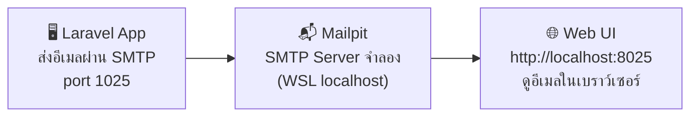
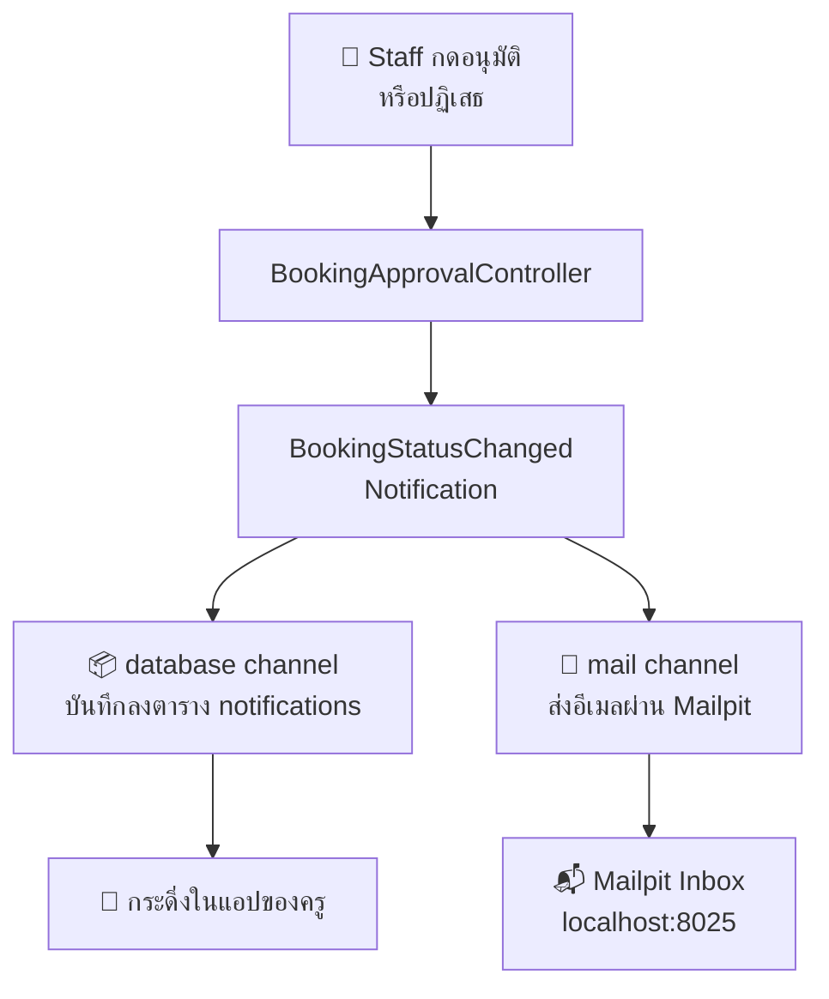

# 📧 ระบบแจ้งเตือนและอีเมล — Workshop Phase 2

> **Workshop ต่อเนื่องจาก [02-workshop.md](./02-workshop.md) — Phase 2**
> เสริมระบบ MVP ด้วย **In-App Notification** (กระดิ่งแจ้งเตือนในแอป) และ **Mail Alert** (อีเมลอัตโนมัติ)
> 💡 ทดสอบอีเมลในเครื่องด้วย **Mailpit** — Email Testing Tool ที่รันบน WSL โดยไม่ต้องส่งอีเมลจริง

---

## 🔧 สิ่งที่ต้องเตรียมก่อนเริ่ม (Prerequisites) {#prerequisites}

> Phase 2 ต่อจาก Phase 1 โปรดทำให้ครบก่อน:
> - **ระบบ MVP ทำงานสมบูรณ์:** ผ่าน Verification Checklist ใน [02-workshop.md](./02-workshop.md) ครบทุกข้อ
> - **Dev Server กำลังรัน:** `composer run dev` เปิดอยู่ใน Terminal แยก

---

## 1. Mailpit — Email Testing บน WSL {#mailpit}

**Mailpit** คือ Email Testing Tool น้ำหนักเบาที่ทำหน้าที่เป็น **SMTP Server จำลอง** โดยดักจับอีเมลที่แอปส่งออกมาทั้งหมดไว้แสดงในหน้า Web UI แทนที่จะส่งออกอินเทอร์เน็ตจริง เหมาะมากสำหรับการพัฒนาและทดสอบระบบอีเมลบน WSL



### 📦 ติดตั้ง Mailpit บน WSL

```bash
# ติดตั้ง Mailpit ด้วย install script อย่างเป็นทางการ (รองรับ Linux/WSL)
sudo bash < <(curl -sL https://raw.githubusercontent.com/axllent/mailpit/develop/install.sh)

# ตรวจสอบการติดตั้ง
mailpit --version
```

### ▶️ รัน Mailpit

เปิด Terminal หน้าต่างใหม่ใน WSL แล้วรันคำสั่งนี้ **ค้างไว้ตลอดการพัฒนา:**

```bash
mailpit
```

เมื่อรันสำเร็จจะแสดงข้อความ:

```
INFO  starting Mailpit...
INFO  accessible via:
INFO    http://0.0.0.0:8025
INFO  SMTP server listening on [::]:1025
```

เปิดเบราว์เซอร์ไปที่ **`http://localhost:8025`** เพื่อเข้าสู่หน้า Inbox ของ Mailpit

> [!TIP]
> **WSL Tip:** หาก `localhost:8025` ไม่เปิด ให้ลองใช้ IP ของ WSL แทน: รัน `hostname -I` เพื่อดู IP แล้วใช้ `http://<WSL-IP>:8025`

### ⚙️ ตั้งค่า Laravel ให้ส่งอีเมลผ่าน Mailpit

เปิดไฟล์ `.env` ของโปรเจกต์ Laravel แล้วแก้ไข Mail settings:

```bash
MAIL_MAILER=smtp
MAIL_HOST=127.0.0.1
MAIL_PORT=1025
MAIL_USERNAME=null
MAIL_PASSWORD=null
MAIL_ENCRYPTION=null
MAIL_FROM_ADDRESS="noreply@pcru.ac.th"
MAIL_FROM_NAME="${APP_NAME}"
```

### 🔍 วิธีตรวจสอบ Mailpit ทำงาน

```bash
# ทดสอบส่งอีเมลด้วย Artisan Tinker
php artisan tinker

# พิมพ์คำสั่งนี้ใน Tinker prompt
Mail::raw('ทดสอบส่งอีเมลจาก Laravel', fn($m) => $m->to('test@example.com')->subject('Mailpit Test'));
```

หากตั้งค่าถูกต้อง อีเมลจะปรากฏใน **`http://localhost:8025`** ทันที

---

## 2. ขั้นตอนปฏิบัติการ Phase 2 (5 Steps) {#steps-p2}

---

### 📬 Phase 2: ระบบแจ้งเตือนและอีเมล

#### Step 9: ตั้งค่า Mailpit และตาราง Notifications (P-09) {#step-9}
* **เป้าหมาย:** ยืนยันว่า Laravel ส่งอีเมลผ่าน Mailpit ได้ และสร้างตาราง `notifications` สำหรับเก็บ In-App Notification
* **⚡ Short Prompt:**
  ```text
  รัน php artisan notifications:table และ migrate เพื่อสร้างตาราง notifications สำหรับเก็บการแจ้งเตือนในระบบ
  ```
* **🔍 วิธีตรวจสอบ:**
  ```bash
  php artisan db:show --table=notifications
  ```

---

#### Step 10: สร้าง Notification สำหรับแจ้งผลการพิจารณา (P-10) {#step-10}
* **เป้าหมาย:** สร้าง `BookingStatusChanged` Notification ที่ส่งพร้อมกัน 2 ช่องทาง ได้แก่ Database (In-App) และ Mail (อีเมล) เมื่อ Staff กดอนุมัติหรือปฏิเสธคำขอจอง
* **📊 แผนภาพการทำงาน:**



* **⚡ Short Prompt:**
  ```text
  สร้าง app/Notifications/BookingStatusChanged.php ที่ใช้ทั้ง database และ mail channel พร้อมส่งข้อมูล booking title, สถานะ (approved/rejected) และ rejection_note ให้ครูผู้จอง
  ```

---

#### Step 11: สร้าง Mailable สำหรับยืนยันการจอง (P-11) {#step-11}
* **เป้าหมาย:** สร้าง `BookingConfirmation` Mailable สำหรับอีเมลยืนยันที่ส่งให้ครูทันทีเมื่อยื่นคำขอจองสำเร็จ (สถานะ pending)
* **⚡ Short Prompt:**
  ```text
  สร้าง app/Mail/BookingConfirmation.php และ Blade view resources/views/emails/booking-confirmation.blade.php สำหรับส่งอีเมลยืนยันการยื่นจองห้องให้ครู ระบุชื่อห้อง วันเวลา และสถานะรออนุมัติ
  ```
* **🔍 วิธีตรวจสอบ:** หลังทำ Step 12 เสร็จ ให้ลองยื่นจองห้องด้วยบัญชี Teacher แล้วเช็ค `http://localhost:8025`

---

#### Step 12: เชื่อม Notification และ Mail เข้า Controllers (P-12) {#step-12}
* **เป้าหมาย:** ผูก Notification + Mailable เข้ากับ Controllers ที่มีอยู่แล้ว ได้แก่ `BookingController@store` (ส่งอีเมลยืนยัน) และ `Staff\BookingApprovalController` (ส่ง Notification เมื่ออนุมัติ/ปฏิเสธ)

> [!NOTE]
> **⏱ Step นี้ใช้เวลานานพอสมควร** — AI ต้องแก้ไข Controllers หลายไฟล์ หาก AI หยุดกลางทางให้ Prompt ต่อว่า `"ทำต่อจากจุดที่ค้างอยู่"`

* **⚡ Short Prompt:**
  ```text
  เชื่อม BookingConfirmation mail เข้า BookingController@store หลังบันทึก booking สำเร็จ และเชื่อม BookingStatusChanged notification เข้า Staff\BookingApprovalController ทั้งเมธอด approve และ reject
  ```

---

#### Step 13: หน้าจอกระดิ่งแจ้งเตือน React (P-13) {#step-13}
* **เป้าหมาย:** เพิ่ม Notification Bell ในแถบนำทาง แสดงจำนวนการแจ้งเตือนที่ยังไม่ได้อ่าน และสร้าง endpoint สำหรับกดอ่านแล้ว (mark as read)
* **⚡ Short Prompt:**
  ```text
  แชร์ unread_notifications_count ผ่าน HandleInertiaRequests และสร้าง NotificationBell component ใน AuthenticatedLayout.jsx ที่แสดงจำนวนแจ้งเตือนที่ยังไม่อ่าน พร้อม endpoint PATCH /notifications/{id}/read สำหรับกดอ่านแล้ว
  ```

---

## 3. ตารางตรวจสอบผลงาน Phase 2 {#checklist-p2}

### 💡 เปิด 3 หน้าต่างพร้อมกัน

| หน้าต่าง | คำสั่ง | หน้าที่ |
|:---|:---|:---|
| **Terminal 1** | `composer run dev` | รัน Laravel + Vite |
| **Terminal 2** | `mailpit` | รัน SMTP Server จำลอง |
| **เบราว์เซอร์ Tab 1** | `http://localhost:8000` | เว็บแอปพลิเคชัน |
| **เบราว์เซอร์ Tab 2** | `http://localhost:8025` | Mailpit Inbox |

### ✅ ลำดับขั้นตอนทดสอบ

| บทบาท | การดำเนินการทดสอบ | ผลลัพธ์ที่ต้องเห็น | ผ่าน |
|:---|:---|:---|:---:|
| **Teacher** | ล็อกอิน → จองห้องประชุมใหม่ | อีเมลยืนยันการจองปรากฏใน **Mailpit** ทันที | [ ] |
| **Staff** | ล็อกอิน → กดอนุมัติคำขอของครู | Teacher เห็นตัวเลขสีแดงบนกระดิ่ง 🔔 และอีเมลแจ้ง **"อนุมัติแล้ว"** ใน Mailpit | [ ] |
| **Staff** | กดปฏิเสธคำขออีกรายการ พร้อมกรอกเหตุผล | Teacher เห็นกระดิ่งแจ้งเตือน และอีเมลแจ้ง **"ถูกปฏิเสธ"** พร้อมเหตุผลใน Mailpit | [ ] |
| **Teacher** | คลิกกระดิ่ง 🔔 เพื่ออ่านการแจ้งเตือน | ตัวเลขสีแดงหายไปหลังกดอ่าน | [ ] |

---

## 💾 บันทึก Checkpoint Phase 2 เข้าสู่ระบบ Git {#checkpoint-p2}

```bash
git add .
git commit -m "feat: add in-app notification and mail alert system (Phase 2)"
```

> **🎉 ยินดีด้วย!** ระบบจองห้องประชุมสมบูรณ์แบบพร้อมทั้ง CRUD, Approval Flow, In-App Notification และ Mail Alert แล้ว!
