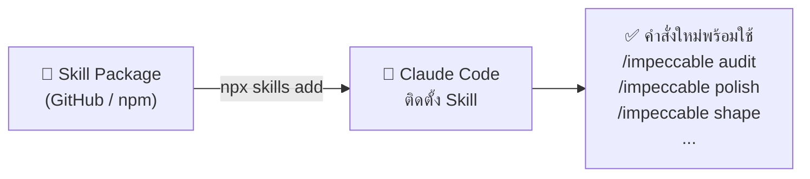
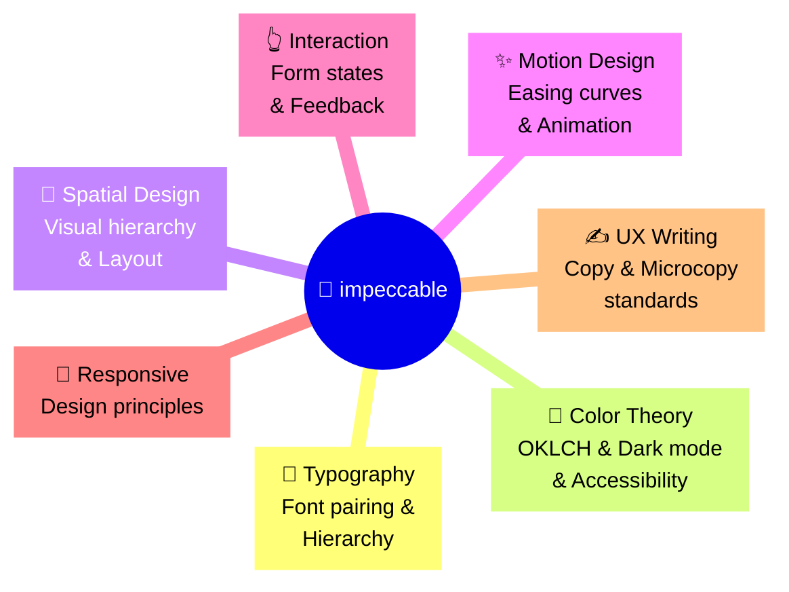
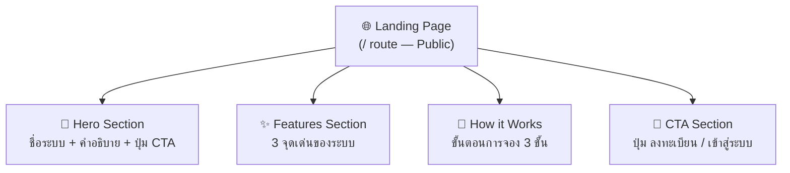
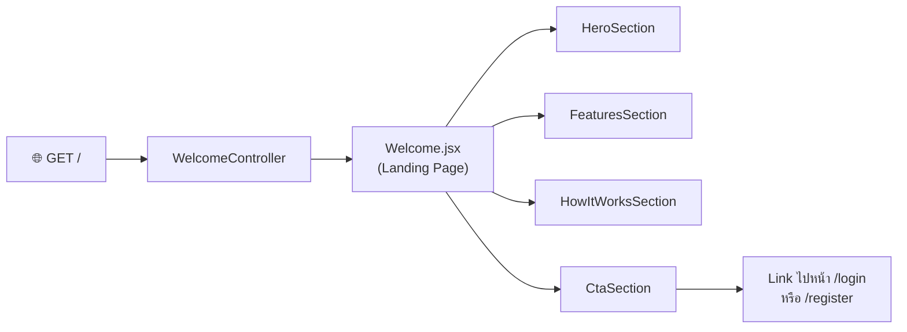

# 🎨 Landing Page — Workshop Phase 3

> **Workshop ต่อเนื่องจาก [03-workshop-phase2.md](./03-workshop-phase2.md) — Phase 3**  
> ยกระดับระบบจองห้องประชุมด้วย **Landing Page** สาธารณะที่ดึงดูดผู้ใช้งาน  
> 💡 ใช้ **impeccable Skill** เป็น Design System Coach ที่คอยตรวจสอบและปรับปรุงคุณภาพงาน Frontend โดยตรงใน Claude Code

---

## 🔧 สิ่งที่ต้องเตรียมก่อนเริ่ม (Prerequisites) {#prerequisites}

> Phase 3 ต่อจาก Phase 1 + Phase 2 โปรดทำให้ครบก่อน:
> - **ระบบ MVP ทำงานสมบูรณ์:** ผ่าน Verification Checklist ใน [02-workshop.md](./02-workshop.md) ครบทุกข้อ
> - **ระบบแจ้งเตือนพร้อม:** ผ่าน Checklist Phase 2 ใน [03-workshop-phase2.md](./03-workshop-phase2.md) ครบทุกข้อ
> - **Dev Server กำลังรัน:** `composer run dev` เปิดอยู่ใน Terminal แยก
> - **Node.js ติดตั้งแล้ว:** ตรวจสอบด้วย `node --version` (ต้องการ v18+)

---

## 🧠 บทเรียนสำคัญ: การเพิ่ม Skills ให้ AI Agent ด้วย npx {#skills-lesson}

ใน Workshop ก่อนหน้า เราใช้ **Laravel Boost AI** เป็น Skill สำเร็จรูปที่ติดมากับ Laravel  
แต่ในโลกจริง **ชุมชน Open Source** ได้สร้าง Skills เฉพาะทางมากมายที่สามารถติดตั้งเพิ่มเติมเข้า Claude Code ได้ทันที



### ✨ Skills คืออะไร?

**Skill** คือ "คู่มือผู้เชี่ยวชาญเฉพาะด้าน" ที่ถูกโหลดเข้าสู่ AI Agent  
เปรียบเสมือนการจ้าง **Consultant ผู้เชี่ยวชาญ** มาช่วยงานชั่วคราว:

| วิธีดั้งเดิม | ใช้ Skill |
|:---|:---|
| ต้องเขียน Prompt อธิบาย Design Principle ทุกครั้ง | Skill จำกฎไว้แล้ว — สั่งสั้นๆ ก็ได้ผล |
| AI ไม่รู้ว่า Anti-pattern คืออะไรสำหรับโปรเจกต์นี้ | Skill มี 27 กฎ + 12 AI checks ตรวจให้อัตโนมัติ |
| ต้องอธิบาย Typography, Color, Motion ทุกรอบ | Skill เข้าใจ Design System ทั้งหมดอยู่แล้ว |

---

## 1. ติดตั้ง impeccable Skill {#install}

เปิด **Terminal ใน WSL** (ไม่ต้องอยู่ในโปรเจกต์ Laravel — รันจากที่ไหนก็ได้) แล้วรันคำสั่งนี้:

```bash
npx skills add https://github.com/pbakaus/impeccable --skill impeccable
```

> [!NOTE]
> **คำสั่งนี้ทำอะไร?**
> - `npx skills` — เรียกใช้ Skills Manager ของ Claude Code  
> - `add` — ติดตั้ง Skill ใหม่เข้าระบบ  
> - `https://github.com/pbakaus/impeccable` — ดึง Skill จาก GitHub Repository  
> - `--skill impeccable` — ตั้งชื่อ Skill ว่า `impeccable` เพื่อเรียกใช้ใน Claude Code

เมื่อติดตั้งสำเร็จ Claude Code จะตอบกลับว่า Skill พร้อมใช้งานแล้ว

> [!TIP]
> **ตรวจสอบการติดตั้ง:** เปิด Claude Code แล้วพิมพ์ `/impeccable help` — ถ้าขึ้นรายการคำสั่งแสดงว่าติดตั้งสำเร็จ

---

## 2. ทำความรู้จัก impeccable {#overview}

**impeccable** คือ Design System Skill ที่ทำหน้าที่เป็น **"หัวหน้าทีม Design"** คอยตรวจสอบและปรับปรุงคุณภาพ Frontend Code ให้ได้มาตรฐานระดับ Production

### 🎯 ความสามารถหลัก 7 ด้าน



### 📋 คำสั่งที่ใช้ใน Workshop นี้

| คำสั่ง | หน้าที่ | ใช้เมื่อไหร่ |
|:---|:---|:---|
| `/impeccable shape` | วางแผน UX/UI Layout ก่อนเขียนโค้ด | ก่อนเริ่ม Step แรก |
| `/impeccable audit` | ตรวจสอบปัญหาเชิงเทคนิค (27 กฎ + 12 AI checks) | หลังสร้าง Landing Page เสร็จ |
| `/impeccable polish` | ปรับปรุงให้พร้อม Ship (Production-ready) | ก่อน Commit |
| `/impeccable animate` | เพิ่ม Motion และ Animation | ขั้นตอนสุดท้าย |
| `/impeccable colorize` | ตรวจสอบและปรับ Color Palette | หลัง audit |
| `/impeccable critique` | วิเคราะห์ UX เชิงลึก | ถ้าต้องการ Feedback เพิ่ม |

> [!NOTE]
> **คำสั่งรับ Focus Area ได้:** ระบุส่วนที่ต้องการได้ เช่น  
> `/impeccable audit the hero section` หรือ `/impeccable polish the navigation`

---

## 3. ขั้นตอนปฏิบัติการ Phase 3 (4 Steps) {#steps-p3}

---

### Step 14: วางแผน Landing Page ด้วย `/impeccable shape` (P-14) {#step-14}

* **เป้าหมาย:** ให้ impeccable ช่วยวางแผนโครงสร้าง UX/UI ของ Landing Page ก่อนเขียนโค้ด  
  Landing Page นี้จะเป็น **หน้าสาธารณะ (Public)** ที่แสดงก่อนหน้า Login เพื่อแนะนำระบบจองห้องประชุม

* **📊 โครงสร้างที่คาดหวัง:**



* **⚡ Short Prompt ใน Claude Code:**
  ```text
  /impeccable shape
  
  Landing page สำหรับระบบจองห้องประชุมมหาวิทยาลัย มี 4 ส่วน: Hero (ชื่อระบบ + CTA), Features (3 จุดเด่น), How it Works (3 ขั้นตอน), CTA (ลงทะเบียน/Login)
  ```

* **🔍 สิ่งที่ควรได้:** impeccable จะส่งคืน Layout Blueprint, Component Structure, และคำแนะนำ Content ก่อนเริ่ม Step 15

---

### Step 15: สร้าง Landing Page React (P-15) {#step-15}

* **เป้าหมาย:** สั่ง Claude Code สร้าง Landing Page จาก Blueprint ที่ได้จาก Step 14  
  หน้านี้จะแทนที่ `Welcome.jsx` ที่ Laravel สร้างมาให้เริ่มต้น (ถ้ามี) หรือสร้างใหม่ทับ Route `/`

* **📊 แผนภาพ Route และ Component:**



* **⚡ Short Prompt ใน Claude Code:**
  ```text
  สร้าง Landing Page ตาม Blueprint จาก impeccable shape เมื่อกี้ ใช้ React + Tailwind CSS แทนที่ Welcome.jsx ที่ Route / ให้หน้านี้เป็น Public (ไม่ต้อง Login) มีปุ่ม "เข้าสู่ระบบ" และ "ลงทะเบียน" เชื่อม Route ของ Laravel Breeze
  ```

* **🔍 วิธีตรวจสอบ:**
  - เปิดเบราว์เซอร์ `http://localhost:8000` ในโหมด Incognito (ไม่ Login)
  - ต้องเห็น Landing Page โดยไม่ถูก Redirect ไปหน้า Login
  - ปุ่ม "เข้าสู่ระบบ" ต้องพาไปที่ `/login` ได้ถูกต้อง

---

### Step 16: ตรวจสอบและปรับปรุงด้วย impeccable (P-16) {#step-16}

* **เป้าหมาย:** ใช้ impeccable ตรวจจับ Design Anti-patterns และปรับให้ได้มาตรฐาน Production

> [!NOTE]
> **27 กฎ + 12 AI Checks:** impeccable ตรวจสอบปัญหาที่ AI มักสร้างโดยไม่รู้ตัว เช่น  
> Font ซ้ำซาก, Contrast ไม่ผ่าน WCAG, Card ซ้อน Card มากเกินไป, Easing Effect ล้าสมัย

* **⚡ Short Prompt — ตรวจสอบ (Audit):**
  ```text
  /impeccable audit the landing page
  ```

* **⚡ Short Prompt — ปรับสีให้สอดคล้อง:**
  ```text
  /impeccable colorize
  ```

* **⚡ Short Prompt — ขัดเกลาให้พร้อม Ship:**
  ```text
  /impeccable polish the landing page
  ```

* **🔍 วิธีตรวจสอบ:** หลัง `/impeccable audit` ผ่านโดยไม่มี Critical Issues

---

### Step 17: เพิ่ม Animation ด้วย impeccable (P-17) {#step-17}

* **เป้าหมาย:** เพิ่ม Motion Design ที่เหมาะสมให้ Landing Page ดูมีชีวิตชีวา  
  impeccable จะเลือก Easing Curves และ Timing ที่ถูกต้องตาม Motion Design Principles โดยอัตโนมัติ

* **⚡ Short Prompt:**
  ```text
  /impeccable animate the landing page
  
  ต้องการ: Hero section fade-in, Features card stagger entrance, scroll-triggered sections
  ```

* **🔍 วิธีตรวจสอบ:**
  - Reload หน้า `http://localhost:8000` แล้ว Scroll ดู Animation
  - Animation ต้องไม่กระตุก (Jank-free)
  - ต้องไม่รบกวน Accessibility (`prefers-reduced-motion` ต้องได้รับการเคารพ)

> [!TIP]
> ถ้าต้องการให้ Animation เบาลง: `/impeccable quieter` ถ้าต้องการให้ดูโดดเด่นขึ้น: `/impeccable bolder`

---

## 4. ตารางตรวจสอบผลงาน Phase 3 {#checklist-p3}

### ✅ Verification Checklist

| รายการตรวจสอบ | วิธีทดสอบ | ผ่าน |
|:---|:---|:---:|
| Landing Page เปิดได้ใน Incognito | `http://localhost:8000` โดยไม่ Login | [ ] |
| ปุ่ม "เข้าสู่ระบบ" → `/login` ถูกต้อง | คลิกปุ่มแล้วดู URL | [ ] |
| ปุ่ม "ลงทะเบียน" → `/register` ถูกต้อง | คลิกปุ่มแล้วดู URL | [ ] |
| `/impeccable audit` ไม่มี Critical Issues | รันคำสั่งและอ่าน Report | [ ] |
| Animation ทำงานเมื่อ Scroll | Scroll ผ่านแต่ละ Section | [ ] |
| Responsive บน Mobile | DevTools → Toggle Device Toolbar | [ ] |

---

## 💾 บันทึก Checkpoint Phase 3 เข้าสู่ระบบ Git {#checkpoint-p3}

```bash
git add .
git commit -m "feat: add public landing page with impeccable design system (Phase 3)"
```

> **🎉 ยินดีด้วย!** ระบบจองห้องประชุมสมบูรณ์แบบแล้ว — ครบทั้ง CRUD, Approval Flow, Notification, Mail Alert และ Landing Page ระดับ Production!
