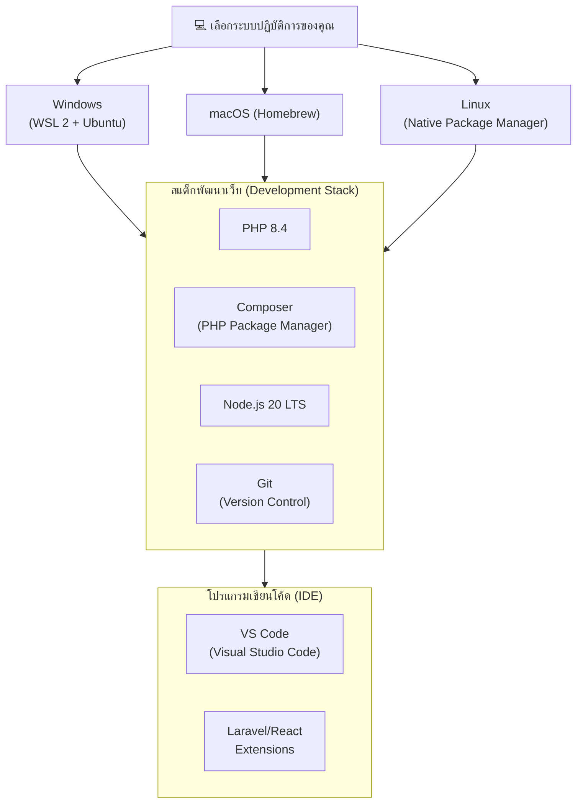

#    ความต้องการของระบบและซอฟต์แวร์ (System Requirements)

เพื่อให้การเรียนการสอนในหลักสูตร **Laravel + AI Agent Bootcamp & Workshop** เป็นไปอย่างราบรื่นและมีประสิทธิภาพสูงสุด ผู้เข้าอบรมกรุณาจัดเตรียมเครื่องคอมพิวเตอร์และซอฟต์แวร์ต่างๆ ให้พร้อมใช้งานก่อนเริ่มคลาสเรียนตามรายละเอียดดังต่อไปนี้:

---

## 🛠️ 1. ความต้องการด้านฮาร์ดแวร์ (Hardware Requirements)

คอมพิวเตอร์ของคุณต้องสามารถรันระบบพัฒนาเว็บแอปพลิเคชัน (Laravel + React) พร้อมกับการใช้งาน AI Agent CLI และ IDE ควบคู่กันได้อย่างราบรื่น

| องค์ประกอบ | สเปกขั้นต่ำ (Minimum) | สเปกแนะนำ (Recommended) | หมายเหตุ |
| :--- | :--- | :--- | :--- |
| **หน่วยประมวลผล (CPU)** | Intel Core i5 (Gen 8th+) / AMD Ryzen 5 ขึ้นไป หรือ Apple Silicon M1 | Intel Core i7 / AMD Ryzen 7 หรือ Apple Silicon M2 / M3 ขึ้นไป | การรัน WSL 2 และ AI Agent ค่อนข้างใช้การประมวลผลของ CPU พอสมควร |
| **หน่วยความจำ (RAM)** | 8 GB | **16 GB หรือมากกว่า** | สำหรับผู้ใช้ Windows แนะนำ 16 GB เนื่องจาก WSL 2 จะจองหน่วยความจำบางส่วนไปทำงาน |
| **พื้นที่จัดเก็บข้อมูล (SSD)** | SSD มีพื้นที่ว่างมากกว่า 20 GB | SSD มีพื้นที่ว่างมากกว่า 50 GB | **ห้ามใช้ HDD** เนื่องจากจะส่งผลให้การรันคำสั่ง `npm install` หรือ `composer` ช้ามาก |
| **การเชื่อมต่ออินเทอร์เน็ต** | ความเร็ว 10 Mbps ขึ้นไป | ความเร็ว 50 Mbps ขึ้นไป (เสถียร) | จำเป็นต้องใช้ในการดาวน์โหลดไลบรารีและเรียกใช้งาน AI API ตลอดการอบรม |

---

## 🖥️ 2. ระบบปฏิบัติการที่รองรับ (Supported Operating Systems)

ผู้เข้าอบรมสามารถใช้ระบบปฏิบัติการใดระบบปฏิบัติการหนึ่งดังต่อไปนี้:

###  Windows 10 / 11 (แนะนำเป็นพิเศษ)
* **เวอร์ชัน:** Windows 10 (Build 19041 หรือสูงกว่า) หรือ Windows 11
* **ความจำเป็น:** ต้องรองรับการทำงานของ **WSL 2 (Windows Subsystem for Linux)**
* *หมายเหตุ: โปรดเปิดใช้งาน Virtualization (VT-x / AMD-V) ใน BIOS ของคอมพิวเตอร์ก่อนเข้าอบรม*

###  macOS
* **เวอร์ชัน:** macOS 12 (Monterey) หรือใหม่กว่า (รองรับทั้งชิป Intel และ Apple Silicon)

###  Linux
* **เวอร์ชัน:** Ubuntu 22.04 LTS หรือเวอร์ชันที่ใหม่กว่า

---

## 💾 3. เครื่องมือและซอฟต์แวร์ที่ต้องเตรียมพร้อม (Software & Stack)

กรุณาติดตั้งและตรวจสอบเครื่องมือเหล่านี้ในเครื่องของคุณ (อ้างอิงตามขั้นตอนในบทเรียน [01-lesson.md](./01-lesson.md)):



### 3.1 สแต็กการพัฒนาเว็บ (Development Stack)

* 🐘 ** PHP 8.4:** ภาษาฝั่งเซิร์ฟเวอร์หลักที่ใช้พัฒนา Laravel 13
* 📦 ** Composer:** ตัวจัดการแพ็กเกจ (Dependency Manager) สำหรับภาษา PHP
* ⚡ ** Node.js 20 LTS & npm:** จำเป็นสำหรับใช้รัน Frontend Build Tools (Vite, Tailwind CSS และ React 19)
* 📂 ** Git:** ระบบควบคุมเวอร์ชัน เพื่อจัดเก็บและบันทึกประวัติการพัฒนาโค้ด

### 3.2 เอดิเตอร์เขียนโค้ด (IDE & Code Editor)

* ✏️ ** VS Code (Visual Studio Code):** เอดิเตอร์หลักที่แนะนำสำหรับการพัฒนาในคอร์สนี้
* **ส่วนเสริมแนะนำ (VS Code Extensions):**
  * `PHP Intelephense` (สำหรับ Auto-complete และจัดการ Syntax PHP)
  * `Tailwind CSS IntelliSense` (สำหรับช่วยแนะนำคลาสดีไซน์)
  * `Prettier - Code formatter` (สำหรับจัดระเบียบโค้ดให้สะอาดเรียบร้อย)
  * `ES7+ React/Redux/React-Native snippets` (สำหรับสร้างโครงสร้างหน้า React ได้รวดเร็ว)
  * สำหรับ Windows (WSL 2) ต้องติดตั้ง extension `WSL` เพื่อเชื่อมต่อ IDE เข้าสู่ Ubuntu container

---

## 🤖 4. บัญชีผู้ใช้และคีย์สำหรับการเข้าถึง AI (AI API & Developer Accounts)

เนื่องจากการอบรมนี้มุ่งเน้น **AI-Assisted Development** ผู้เรียนจะต้องเข้าถึง API Key ของ AI สำหรับเอเจนต์พัฒนาโค้ด:

* 🔑 ** บัญชี Google สำหรับ Antigravity CLI:** เข้าใช้งานผ่านการยืนยันตัวตนแบบ Google Native OAuth บน Terminal (ไม่ต้องใช้คีย์ `GEMINI_API_KEY`)
  * **แผนบริการของบัญชี:**
    * **ขั้นต่ำ (Minimum):** บัญชี Google แผนบริการ **Individual** (แผนฟรี $0/เดือน สำหรับใช้งานทั่วไป)
    * **แนะนำสำหรับการอบรม (Recommended):** แผนบริการ **Google AI Pro** ($20/เดือน) เพื่อเพิ่มโควตาขีดจำกัดอัตราการสั่งการ (Rate Limits) และขยายปริมาณหน่วยประมวลผล (Token Credit Pool) ทำให้พัฒนาโค้ดเวิร์กชอปร่วมกับ AI Agent ได้อย่างราบรื่นโดยไม่สะดุดระหว่างคลาสเรียน
* 🔑 ** Anthropic API Key / Claude Account:** สำหรับใช้งาน **Claude Code** (AI Agent ของ Anthropic) สามารถลงทะเบียนออกคีย์ที่ [Anthropic Console](https://console.anthropic.com)
* 🐙 ** บัญชี GitHub:** สำหรับการเก็บรักษาซอร์สโค้ดและแชร์โค้ดร่วมกับผู้สอน/ผู้เข้าอบรมคนอื่นๆ สมัครใช้งานได้ฟรีที่ [GitHub](https://github.com)

---

## 📋 5. เช็คลิสต์ตรวจสอบความพร้อมก่อนเข้าอบรม (Pre-Class Verification Checklist)

กรุณาเปิด Terminal (หรือ Ubuntu Terminal บน WSL 2) และรันคำสั่งด้านล่างนี้เพื่อตรวจสอบว่าพร้อมสำหรับการเรียน:

### 1️⃣ ตรวจสอบสแต็กการพัฒนาเบื้องต้น
```bash
# 1. ตรวจสอบเวอร์ชันของ PHP (ต้องเป็น 8.4.x)
php -v

# 2. ตรวจสอบเวอร์ชันของ Composer (ควรเป็นเวอร์ชัน 2.x ขึ้นไป)
composer -V

# 3. ตรวจสอบเวอร์ชันของ Node.js (ควรเป็น 20.x หรือสูงกว่า)
node -v

# 4. ตรวจสอบเวอร์ชันของ Git
git --version
```

### 2️⃣ ตรวจสอบการติดตั้ง AI Agent CLI
```bash
# ตรวจสอบตัวติดตั้ง Antigravity CLI
agy --version

# ตรวจสอบตัวติดตั้ง Claude Code
claude --version
```

---

> [!IMPORTANT]
> **หากพบปัญหาการติดตั้งเครื่องมือใดๆ หรือผลลัพธ์ไม่ตรงตามเงื่อนไขด้านบน**
> ขอให้ผู้เข้าอบรมเข้าไปศึกษาขั้นตอนการลงสแต็กโดยละเอียดในบทเรียน **[01-lesson.md](./01-lesson.md)** หรือติดต่อผู้จัดอบรมเพื่อขอคำแนะนำเพิ่มเติมก่อนเริ่มการอบรมจริง
